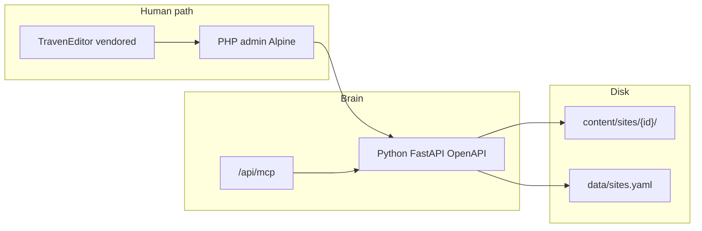

# Developer Knowledgebase

A living reference for human and agentic developers working on **PenCMS** — sticky notes for easy-to-forget host truths, plus a map of where deeper docs live.

This is the PenCMS counterpart to Traven’s [`docs/dev/knowledgebase.md`](../../../../traven/docs/dev/knowledgebase.md). Traven owns editor/CodeMirror internals; PenCMS owns catalogs, resolvers, Alpine admin, multisite, and MCP.

---

## Maintenance contract

| Rule | Detail |
| :--- | :--- |
| **Audience** | Developers and agentic pair-programmers on PenCMS |
| **Add an entry** | One gotcha = short title + 2–5 sentences (“why this bites”) + code/doc paths |
| **Promote out** | If a sticky note grows into a full guide, move deep prose to `core/docs/*.md` and leave a one-liner + link here |
| **Ephemeral notes** | Session handoffs stay under `gitignore/`. Link them when useful; never copy session prose into this file |
| **Boundary** | Traven-core (CM6 decorations, Lezer, skins) → Traven KB. Host wiring (Alpine, PHP resolve, site identity, MCP binding) → here |

---

## 1. Doc map

Canonical guides — prefer these over restating chapters here:

| Topic | Doc |
| :--- | :--- |
| Product north star | [`product_thesis.md`](../product_thesis.md) |
| Link suggest + `[expand]` / `[embed]` | [`editor-link-suggest-and-expand.md`](../editor-link-suggest-and-expand.md) |
| Shortcodes (attrs / HTML / classes) | [`traven-shortcodes.md`](../traven-shortcodes.md) |
| Themes (blueprint) | [`pencms-theme-development.md`](../pencms-theme-development.md) |
| Themes (scaffold / switch / validate) | [`theme-adding.md`](../theme-adding.md) |
| Theme Social / OG contract | [`theme-social-preview.md`](theme-social-preview.md) |
| SEO Settings (operators) | [`seo-settings.md`](../seo-settings.md) |
| Users + agent keys (operators) | [`users-and-access.md`](../users-and-access.md) |
| Site authors / bylines | Sticky **C6** below; Twig contract in [`pencms-theme-development.md`](../pencms-theme-development.md) §5 |
| MCP / agents | [`mcp_guide.md`](../mcp_guide.md), agent index [`llms.txt`](../llms.txt) |
| TravenEditor API (vendored) | [`AI-and-TravenEditor-API-reference.md`](AI-and-TravenEditor-API-reference.md) |
| Host vs editor philosophy | [`AI-MCP-Traven.md`](AI-MCP-Traven.md) |
| Dual-scope CSS / editor skins | [`traven-theme-development.md`](traven-theme-development.md) |
| Deploy | [`deploy_compose.md`](../deploy_compose.md), [`lan_https.md`](../lan_https.md) |
| Traven editor internals | Sibling repo: `traven/docs/dev/knowledgebase.md` (do not duplicate) |
| Active session handoffs | Ephemeral under `gitignore/` (e.g. admin half-legacy UX) — not canonical |

OpenAPI contract: [`core/openapi.yaml`](../../openapi.yaml). Early blueprint / brainstorm essays are historical; prefer the thesis when they conflict.

---

## 2. Architecture at a glance



**Locked facts** (see [`product_thesis.md`](../product_thesis.md)):

- One install · one operator · many sites · one MCP `aud`. Site isolation is agent key + JWT `site_id`, not a separate OAuth resource per site.
- Public site identity: **Host** domain match first; `?site=` / cookie only when Host misses (admin preview).
- Multisite backend is closed. Remaining work is admin half-legacy UX (`gitignore/admin_half_legacy_handoff.md`) — do not reopen Host / `aud` / god-keys topology.

---

## 3. Sticky notes

Hard-won truths that are easy to rediscover the hard way. Append new ones under the matching group.

### A. Editor / expand / Alpine

#### A1. `text` vs `heading` on expand/embed

These look similar in the modal but do different jobs:

- `heading` = which **section** of the target post to pull (resolver slice). Leave blank → whole post.
- `text` = what the **reader/editor sees** as the link/chip label.

Example:

```markdown
[expand slug="christmas-in-finland" text="Click to expand…" heading="Rovaniemi: The Official Home of Santa Claus"]
```

Without `text`, older UI misused `heading` as the label (and risked slicing the wrong section). Label fallback: `text` → `heading` → post `hero_title` / `name` / `title` (PHP) → `slug`.

**Lives:** [`editor-link-suggest-and-expand.md`](../editor-link-suggest-and-expand.md); `ExpandResolver::resolveDisplayTitle()`; `ShortcodeProcessor.php`; AI tool copy in `ai-sidebar.js`.

#### A2. Runtime: insert-after-trigger + punct peel

Public expand is not “after the paragraph.” PHP emits phrasing-safe `<button class="traven-expand-trigger">` + `<template>` body. `initExpandEmbed()` inserts the panel as a sibling **right after the trigger** (full-width under the link, with a callout arrow).

Trailing punctuation is special: PHP emits `button` + `<template>` + `. So…`, so the period lives **after** the inert template. The runtime skips `<template>`, peels `/^([.,:;!?])(\s)/` into `.traven-expand-punct` beside the button, then places the panel after that — so commas/periods aren’t orphaned under the bubble.

**Lives:** [`editor-link-suggest-and-expand.md`](../editor-link-suggest-and-expand.md) §2; `ShortcodeProcessor.php`; `frontend-php/public/assets/vendor/traven/expand-embed-runtime.js`.

#### A3. Editor `store.pages` is empty until `listPages()`

On the content editor, Alpine’s `store.pages` stays `[]` (pages are only auto-fetched on the dashboard). An empty array is truthy, so `store.pages || listPages()` never fetches. Link typeahead already checked `.length`; save-time expand warn did not — hence false red toasts. Use `ensurePages()` (`!this.pages.length` → `fetchPages()` / `api.listPages()`).

**Lives:** `frontend-php/src/admin/js/store.js` (`ensurePages`, `getPublishedLinkCatalog`); warmed from editor via `wizard4.js`.

#### A4. TravenEditor must live outside Alpine’s Proxy

ES2022 private fields (`#view`, etc.) break when the instance is Alpine-reactive. Keep editors in a closure-scoped `_editors` object, not on Alpine `this`.

**Lives:** `frontend-php/src/admin/js/wizard4.js` (header comment + `_editors`).

#### A5. Admin expand plugin uses `resolve: null`

Editor shows WYSIWYM chips only; real HTML comes from PHP preview/public. Do not assume browser-side host resolve is wired.

**Lives:** `wizard4.js` `_createExpandEmbedPlugins()`; [`editor-link-suggest-and-expand.md`](../editor-link-suggest-and-expand.md) §2.

#### A6. Expand failure modes

| Case | Reader | Author |
| :--- | :--- | :--- |
| Missing / unpublished / future `publish_at` | Silent omit (empty) | Save toast / `ExpandReferenceHealth` |
| Heading miss, slug OK | Whole-post fallback | Prefer fixing heading; not a hard fail |

Nesting stops at **depth 2** (`ExpandResolver::MAX_DEPTH`).

**Lives:** `ExpandResolver.php`; `ExpandReferenceHealth.php`; [`editor-link-suggest-and-expand.md`](../editor-link-suggest-and-expand.md) Failure modes.

#### A7. `[expand]` / `[embed]` are not Twig micro-components

Micro-components are `[component name="…"]…[/component]` → `_name.html.twig` with `{{ slot | raw }}`. Expand/embed are separate shortcodes + Traven plugin + PHP resolver.

**Lives:** [`traven-shortcodes.md`](../traven-shortcodes.md) (generic `[component]`); [`editor-link-suggest-and-expand.md`](../editor-link-suggest-and-expand.md).

#### A8. Expand fragments skip dropcap

`PostRenderer::renderMarkdownFragment()` deliberately omits `apply_dropcap()` so nested expand bodies don’t steal host styling.

**Lives:** `frontend-php/src/core/PostRenderer.php`.

#### A9. Dual-duty skins own title-block type once (`.post-detail-*`) + win with `!important`

A theme can look “half applied” in `admin-editor.php` even when `skin-{id}.css` loads: trumpet / `hero_title` / deck stay system sans-serif, and CodeMirror body text falls back to Tailwind / Traven defaults.

Admin Title Blocks use the **same classes as published Twig** (`.post-detail-trumpet`, `h1.post-detail-title`, `.post-detail-deck` inside `.hero-title-block.traven-preview`). Host [`admin-editor.css`](../../frontend-php/src/admin/css/admin-editor.css) is thin glue only (transparent inputs; headline textarea inherits from `h1`). Do **not** duplicate trumpet/title/deck personality in `styles.css` and again under a separate admin mirror.

Contracts that bite incomplete skins:

1. **`--traven-font-display` / `--traven-font-body` / `--traven-font-mono`** — still required on `:root` (body canvas + any rules that reference the triad). Missing vars → generic fallbacks.
2. **Base stacks need `!important`** — Admin Tailwind Preflight and `traven.css` outrank a plain `font-family` on `.cm-editor` / `.traven-preview`.
3. **One dual-duty rule block** for `.post-detail-trumpet` / `.post-detail-title` / `.post-detail-deck` in the skin (size, weight, tracking, transform, color). Use `!important` so admin inputs win Preflight. Leave structural chrome (eyebrow flex, header borders, title margins) in `styles.css` if needed. Reference: `themes/starter`, `themes/freedomware`, `themes/academic`.
   **Hollow neon exception:** `color: transparent` + `-webkit-text-stroke` / `background-clip: text` hides the caret in the native `hero_title` textarea. Keep neon on published `h1`; solid fill + `caret-color` only on `.hero-title-block.traven-preview .post-detail-title`. Reference: `themes/night`.

**Quick check:** In DevTools on `admin-editor.php`, trumpet + headline + deck + a body paragraph must all resolve to the skin’s webfont and type scale — not Inter / system UI / host defaults.

**Lives:** `frontend-php/src/admin/css/admin-editor.css` (thin glue); `admin-editor.php` (`.hero-title-block` + `.post-detail-*`); [`pencms-theme-development.md`](../pencms-theme-development.md) §6–§7; checklist Editor scope `[D]`.

#### A9b. Site-custom theme sibling must not steal the parent’s editor skin key

`admin-customize.php` can fork any install theme into `sites/{id}/theme/`. The fork keeps the parent’s `editor_skin` stem in `theme.json` (e.g. both install `marut` and the custom tree declare `"editor_skin": "marut"`).

If the editor skin **picker map** also keyed the custom tree as `marut`, `wizard4.applySkin()` replaced the working boot `<link>` (`/blog/themes/marut/assets/css/skin-*.css`) with the custom raw URL (`/api/assets/raw/sites/…/theme/assets/css/…`) — often stale or 404. Symptom: placeholders briefly look correct (boot skin), then loaded content goes unstyled / undersized / wrong color.

**Invariants:**
1. Site-custom picker key is always `custom` (never the parent `editor_skin` stem).
2. `applySkin` for the active boot skin key always uses `PEN_EDITOR_SKIN_BOOT.hrefs`, not a shadowed map entry.

**Regression:** `php frontend-php/cli-tools/test-editor-skin-resolve.php`

**Lives:** `admin/includes/_editor-skin-picker.php`; `admin/includes/_editor-skin-resolve.php`; `admin/js/wizard4.js` (`applySkin`).

#### A9c. Editor skin boot ignores `sites.yaml` without Composer autoload

`_editor-skin-resolve.php` includes `SiteRegistry.php` only (no `PublicSiteContext` / `DossierDiscovery`). `listSites()` needs Symfony Yaml or `ext-yaml`. Public preview and SSG autoload Composer first, so they get `site.theme`. The editor fell through to install `config.ini` `[theme] active` (often `daily`) and labeled that skin `(ACTIVE)`.

**Invariants:**
1. `SiteRegistry.php` loads `vendor/autoload.php` when present.
2. `ext-yaml` (`yaml_parse_file`) remains a fallback, not a required distro package.
3. A SiteRegistry-only include still reads `site.theme` over install `daily`.

**Regression:** `php frontend-php/cli-tools/test-site-registry-autoload.php`

**Lives:** `src/core/SiteRegistry.php`; `_editor-skin-resolve.php`; `_admin-header.php`.

#### A10. `body.traven-preview` bleeds the content skin onto site chrome

PenCMS post templates often set `class="traven-preview"` on `<body>`. Skin rules like `.traven-preview a`, `.traven-preview h1`, and `.traven-preview table` then style **sitename links, post titles, and footer tables** — not only article prose.

**Fix:** Scope prose to `.article-content` (links, tables, heading margins) and add chrome resets for `.post-detail-title`, `.page-heading`, header/footer tables. Reference: `themes/freedomware`.

**Lives:** [`pencms-theme-development.md`](../pencms-theme-development.md) §7 *Published chrome gotchas*; checklist §2b.

#### A11. `overflow-x: hidden` on `.main-container` clips viewport fullbleed

`100vw` + `calc(50% - 50vw)` breakout is correct but invisible when an ancestor uses `overflow-x: hidden` — images/video look partially extended then cropped; video can pin flush-left with the right edge cut off.

**Fix:** `overflow-x: visible` on the main column; `html { overflow-x: clip; }` for scrollbar safety. Do **not** use padding-only breakout (`calc(100% + 16ch)`) as a substitute.

**Lives:** [`pencms-theme-development.md`](../pencms-theme-development.md) §8 fullbleed pitfalls; `themes/freedomware/assets/css/styles.css`.

#### A12. Aggressive CSS reset breaks `sub` / `sup`

Theme resets that set `font: inherit` and `vertical-align: baseline` on `*` flatten subscripts and superscripts in prose and math.

**Fix:** After the reset in `styles.css`, re-declare `sub, sup` (see `starter` / `freedomware`).

**Lives:** `themes/freedomware/assets/css/styles.css`; `themes/starter/assets/css/styles.css`.

#### A13. Header / main / footer column width drift

Independent `max-width` + `margin: auto` (or `body { display: flex; align-items: center }`) on `.site-header`, `.main-container`, and `.site-footer` can yield **different computed widths** — footer tables look narrower than the article column even when all say `80ch`.

**Fix:** One shared grid track (`body { display: grid; grid-template-columns: minmax(0, 80ch); justify-content: center }`) and `width: 100%` on all three shells.

**Lives:** `themes/freedomware/assets/css/styles.css`; [`pencms-theme-development.md`](../pencms-theme-development.md) §7 *Published chrome gotchas*.

### B. Multisite / Host / assets

#### B1. Public site identity: Host first

`Host` domain match is public truth; query/cookie only when Host misses (admin preview). Do not assume `?site=` wins on a mapped domain.

**Lives:** `PublicSiteContext.php`; `SiteRegistry::resolveSiteIdFromRequest()`; [`product_thesis.md`](../product_thesis.md); [`deploy_compose.md`](../deploy_compose.md).

#### B2. Human MCP vs agent MCP site binding

- **Humans:** `X-Pen-Site-Id` / `pen_site_id` cookie (active Content site in admin).
- **Agents:** JWT `site_id` is authoritative — the header is ignored.

One install-wide MCP `aud`; isolation is key + claim, not per-site OAuth resources.

**Lives:** [`mcp_guide.md`](../mcp_guide.md); `backend-python/app/routers/mcp_tools.py`; [`product_thesis.md`](../product_thesis.md).

#### B3. Reassign agent key site ≠ instant JWT update

`PATCH` key `site_id` keeps the secret, but existing JWTs keep the old claim until expiry (~15m). Remint via `POST /api/auth/token` (or OAuth refresh).

**Lives:** [`mcp_guide.md`](../mcp_guide.md) Step 1; `backend-python/app/routers/auth.py`.

#### B4. Install `[General]` is `use_ai` only

Tagline / hero / logo / sitename are per-site (registry / site assets). Unset site theme still falls back to install `[theme] active`; presentation text does **not** fall back to install defaults.

**Lives:** half-legacy handoff (ephemeral); theme / `SiteRegistry` presentation resolution.

#### B5. Content assets are site-scoped URLs

Editor/public use `/api/assets/raw/sites/{id}/assets/...` (not legacy install-wide `/api/assets/raw/images/...` for non-default). `shared/` stays under `/blog/shared/…`. Don’t double-rewrite paths already under `/api/`.

**Lives:** `wizard4.js` `contentAssetUrl` / `toEditorContentUrls`; ThemeEngine content-asset helpers.

#### B6. PHP admin is untrusted chrome

Authorize only from `pen_jwt` / Bearer JWT → user YAML (`role`, `status`, memberships). Never trust `pen_role` / `pen_user_id`. Hidden sidebar is not security. File Storage / SSH / install `config.ini` (`/api/storage/config`, restart, keys, `general`, install theme) require `require_admin`. `publish:content` is PATCH approve/publish only; generic `PUT /api/pages/{id}` does **not** sniff status (stays under `write:posts` / `write:pages`). Agent JWTs: check `type==agent` first — do not inherit the sponsor admin role.

**Lives:** `backend-python/app/services/authz.py`; `routers/users.py`; `routers/auth.py` (`/api/auth/me`); admin `store.js` `hasCap`. Operator How-To: [`users-and-access.md`](../users-and-access.md).

### C. Content model / AI

#### C1. `hero_title` vs `name` vs legacy `title`

Public headline readers see is `hero_title`; `name` is internal/SEO-ish **post title** (`form.name` in the editor); body must not start with `# Title` (H1 comes from frontmatter). Never write legacy `title` (aliased → `name` on input).

Do not confuse post `name` with a site-author record’s `name` field, or with frontmatter key `author` (byline string) — see **C6**.

**Lives:** `ai-sidebar.js` tool / system prompt rules.

#### C2. `create_post` before `write_content_file`

Don’t invent a slug and write. Bootstrap the stub with `create_post`, then write body with the returned slug.

**Lives:** [`mcp_guide.md`](../mcp_guide.md) creating posts; `ai-sidebar.js` `create_post` tool.

#### C3. Scheduled publish is a clock filter, not a status flip

`status: published` + future `publish_at` → embargoed until that UTC instant (no separate `scheduled` status). Static `dist/` only picks them up on next export. `date` ≠ `publish_at`.

**Lives:** [`mcp_guide.md`](../mcp_guide.md); `store.js` `isLivePublished`; AI frontmatter rules.

#### C4. Menu `content_type` only on `type: content`

Never set `content_type` on taxonomy / system / custom / label targets — a frequent agent failure mode.

**Lives:** [`mcp_guide.md`](../mcp_guide.md); `ai-sidebar-navigation.js`.

#### C5. AI images: `relative_path` in `[image]` / frontmatter, not `attach_image_to_post`

`generate_media` already saved the file; `attach_image_to_post` is for user-uploaded chat attachments only. Chat preview uses Markdown ``; post body uses `[image src="relative_path"]`. The same `relative_path` (also returned as `use_for_embedding`) must be copied into frontmatter image fields (`hero_image`, `main_image`) — never invent basenames like `hero.jpg`. `write_content_file` normalizes `/api/assets/raw/...` public URL forms to site-relative paths before persist, and soft-warns via `media_path_warnings` when referenced paths are still missing (write still succeeds).

**Normalize is case-sensitive on purpose.** Only the exact lowercase prefixes `/api/assets/raw/sites/.../assets/` and `/api/assets/raw/images/content/` are rewritten. A mangled `/API/assets/RAW/...` is left untouched and soft-warned as missing/invalid — do not widen to case-insensitive matching without an explicit decision.

**Harness dual schemas (intentional — do not “unify” casually):**

| Field | Live / same-turn MCP write response | Older-turn tool summary (ai-sidebar truncation) |
| :--- | :--- | :--- |
| `media_path_warnings` | Present only when non-empty; shape is a plain `string[]` of messages | For `write_content_file` (and any payload that had warnings): always `{ total, capped, items }` with `capped === (items.length < total)` against a 20-item cap |
| `version_warning` | Present **only** when `expected_version` mismatched **and** `PENCMS_STRICT_CONTENT_VERSION` is off (soft-warn escape hatch); omit key when fine (`null` is never sent live). Default-on strict mode returns **409** `version_conflict` instead and does not persist. | Always `string \| null` on write summaries so agents can distinguish “no concurrency issue” from “stale token” without key-presence checks |

Agents must not call `.items.map()` on a live `media_path_warnings` array, and must not treat absence of live `version_warning` as a schema bug.

**Lives:** `ai-sidebar.js` tools + prompt + older-tool summarization; `mcp_tools.py` (`generate_media`, `normalize_public_media_paths`, `collect_media_path_warnings`).

#### C6. Site authors vs post byline vs post `name`

Three different things share the word “author” / “name”:

| Thing | Meaning |
| :--- | :--- |
| Post frontmatter `name` | Internal/SEO-ish **post title** (see C1). Not a person. |
| Post frontmatter `author` | Free-text **byline string** (e.g. `Jane Doe`). Themes that print the byline use this string. |
| Site author record `name` | Display name of a contributor in `authors.yaml`. |

**Storage:** `content/sites/{site_id}/authors.yaml`. Guest contributors are allowed — no CMS login / UserPublic UUID on author records. Bios are **plain text** (Site Settings → Authors tab).

**API** (human admin; site via `X-Pen-Site-Id`): per-author CRUD — `GET|POST /api/authors/`, `GET|PUT|DELETE /api/authors/{slug}`, `POST /api/authors/{slug}/avatar`. **MCP** (agent JWT `site_id`): `list_authors`, `get_author`, `create_author`, `update_author`, `delete_author` in `mcp_authors.py`. Avatar upload remains REST-only (agent avatar MCP iceboxed / skipped).

**Editor:** Properties → Author is a site-scoped picker (posts only; hidden for pages). Selecting a site author copies `authors[].name` into frontmatter key **`author:`**. Custom… / Clear remain for one-offs and legacy bylines. Never write the byline into post `name`.

**Twig:** global `authors` = list from that site’s `authors.yaml`; global `author` = site-default sidebar/profile object (first site author by `sort_order`, else first `data/users` UserPublic). Post/page context may also expose the byline string as `author` (name collision). `theme.partial('sidebar-profile')` resolves a profile array via `ThemeEngine::resolveSidebarAuthorProfile()`: case-insensitive match of byline → `authors[].name`; unmatched custom byline → name only, no avatar; no byline → site default. Themes must omit `` when `avatar` is null (no placeholder that 404s). Escape plain-text bios in templates (no Markdown pipeline).

**Lives:** `author_service.py`, `routers/authors.py`, `routers/mcp_authors.py`, `models/author.py`; admin `settings-site.js` / `admin-settings-site.php`; editor `wizard4.js` / `admin-editor.php` / `ai-sidebar.js`; `ThemeEngine.php` (`getSiteAuthors` / `getAuthorProfile` / `resolveSidebarAuthorProfile`); OpenAPI `/authors` paths; [`mcp_guide.md`](../mcp_guide.md).

#### C7. Social Previews: theme defaults + sparse site overrides

Do not dump a full Social config into `sites.yaml` on first save. Themes ship a complete `theme.json` → `social_preview` block; the site record only stores overrides (empty string / `og_accent_bar: null` = inherit). Admin form state must keep empty as inherit — never coerce theme defaults into the model (that would write a full copy).

Two image jobs stay distinct: `og_default_hero` (generator fallback) vs `og_default_image` (static site-wide `og:image`). Pillow needs local TTF/OTF — theme `og_fonts` must be TTF/OTF; the admin Font dropdown also offers the core woff2 registry, converted locally at generate time (no Google Fonts CDN). `og_watermark_enabled` (sparse bool, engine default true) gates the PNG overlay; path-only `og_watermark` still falls back to `watermark.png` when enabled. Optional sparse `og_watermark_source` (`logo` uses the site raster logo at render time, not a copy) plus `og_watermark_layout` / `corner` / `scale` (named corner blit; full-canvas remains the inherit default). Admin **Generate preview** shares `og_image.render_og_image` with the publish CLI (draft form values, one synthetic JPEG; look knobs can auto-refresh, still not a WYSIWYG canvas). Optional `hero_data_url` / `watermark_data_url` let unsaved uploads appear in that JPEG; the route never writes site assets or `sites.yaml`.

**Lives:** [`theme-social-preview.md`](theme-social-preview.md); [`seo-settings.md`](../seo-settings.md); `social_preview.py`; `og_image.py`; `og-image-maker.py`; `SiteRegistry::resolveSocialPreview()`; `settings-seo.js`.

### D. MCP / LAN

#### D1. `Mcp-Session-Id` is required after `initialize`

Streamable HTTP (`POST /api/mcp`) mints `Mcp-Session-Id` on `initialize` **and** copies it to JSON-RPC `result.sessionId`. Later JSON-RPC (`tools/list`, `tools/call`) without that header starts a **new, uninitialized** session. Official connectors already echo it; naive curl does not. Authenticated calls other than `initialize` without the header return **400** `mcp_session_required`. Omitted or `*/*` `Accept` is rewritten to JSON+SSE so curl does not get **406**. Session-free door: REST `/api/v1/mcp/*`. Unauthenticated empty POST stays **401** for OAuth discovery.

**Lives:** `services/mcp_session_guard.py`; [`mcp_guide.md`](../mcp_guide.md) Step 3 curl; [`llms.txt`](../llms.txt).

#### D2. uvicorn `--reload` drops MCP sessions

LAN `pencms-api.service` uses `--reload`. StatReload restarts the process; in-memory Streamable HTTP sessions die. Clients must `initialize` again (new `Mcp-Session-Id`). Omit `--reload` when agents keep long MCP sessions. REST is unaffected.

**Lives:** [`lan_https.md`](../lan_https.md); `deploy/lan/pencms-api.service`.

#### D3. Remote `update_frontmatter_field` is HTTP; the sidebar tool is local

The editor AI sidebar `update_frontmatter_field` mutates the open Alpine form and `save()` — it is **not** in `MCP_TOOL_MAP`. Remote MCP agents get a separate `PATCH /api/v1/mcp/pages/{slug}/frontmatter` with the same `operationId`. Do not route the sidebar tool through that HTTP path.

**Lives:** `mcp_tools.update_frontmatter_field`; `ai-sidebar.js` `clientTools` + `update_frontmatter_field()`.

### Scratchpad one-liners

Paste into a session note when useful:

> Expand: `text`=label, `heading`=section; runtime inserts panel after trigger (skip `<template>` for punct peel); editor `store.pages` empty — always `ensurePages()` / `listPages()` if length 0.

> Dual-duty skin: set `--traven-font-display/body/mono`; force `.cm-editor`/`.traven-preview` fonts with `!important`; style `.post-detail-trumpet` / `.post-detail-title` / `.post-detail-deck` once in the skin (admin + publish) or the title strip stays unthemed.

> Published chrome: scope prose to `.article-content` when `body` is `.traven-preview`; grid-align header/main/footer; `overflow-x: visible` on main for `100vw` fullbleed.

> Multisite: Host first for public id; humans `X-Pen-Site-Id` (membership or admin), agents JWT `site_id`; key site PATCH needs remint; install General = `use_ai` only.

> Authz: PHP cookies are chrome; JWT→YAML is root of trust; `publish:content` ≠ host `publish`; PUT does not sniff status; install storage/SSH/`config.ini` is `require_admin`.

> Content/AI: `hero_title` for readers; post `name`=title not byline; byline key `author:` from site-author display name; `create_post` then write; `publish_at` is clock not status; menu `content_type` only on `type: content`.

> Social: theme `social_preview` is complete; site YAML only sparse overrides; empty = inherit; `og_default_hero` ≠ `og_default_image`; OG fonts = theme TTF/OTF plus registry woff2 converted locally.

---

## 4. Where to look in code

| Concern | Start here |
| :--- | :--- |
| Editor mount / catalogs / expand plugin | `frontend-php/src/admin/js/wizard4.js`, `store.js` |
| Editor title block ↔ dual-duty `.post-detail-*` in skin | `admin/css/admin-editor.css` (thin glue); skin `.post-detail-trumpet/title/deck`; KB sticky **A9** |
| Editor skin picker ↔ site-custom must not shadow parent | `_editor-skin-picker.php`; `wizard4.applySkin` boot.hrefs; `cli-tools/test-editor-skin-resolve.php`; KB **A9b** |
| Editor skin boot ignores `sites.yaml` without autoload | `SiteRegistry.php` Composer autoload + ext-yaml fallback; `cli-tools/test-site-registry-autoload.php`; KB **A9c** |
| Published chrome vs `body.traven-preview` | Scope `.article-content`; KB sticky **A10**; [`pencms-theme-development.md`](../pencms-theme-development.md) §7 |
| Fullbleed clipped / timid breakout | `overflow-x` on `.main-container`; padding-only `16ch` hack; KB sticky **A11** |
| Column width header/main/footer | CSS grid shell; KB sticky **A13** |
| Site authors / byline picker | `wizard4.js` (picker); `settings-site.js`; `author_service.py`; `ThemeEngine.php` |
| AI sidebar tools / prompts | `frontend-php/src/admin/js/ai-sidebar.js` |
| Expand resolve / shortcodes | `frontend-php/src/core/ExpandResolver.php`, `ShortcodeProcessor.php`, `ExpandReferenceHealth.php` |
| Expand public runtime | `frontend-php/public/assets/vendor/traven/expand-embed-runtime.js` |
| Public site context | `frontend-php/src/core/PublicSiteContext.php`, `SiteRegistry.php` |
| Social / OG theme defaults + site overrides | `social_preview.py`; `SiteRegistry::resolveSocialPreview()`; `cli-tools/og-image-maker.py`; `settings-seo.js` |
| MCP tools / auth | `backend-python/app/routers/mcp_tools.py`, `auth.py` |
| Human authz / Users API | `backend-python/app/services/authz.py`; `routers/users.py`; KB **B6** |
| Contract | `core/openapi.yaml` |
| Vendored Traven | `frontend-php/public/assets/vendor/traven/` (rebuild from Traven monorepo; rewrite `@freedomware/traven` → `./traven.js` in expand-embed) |
