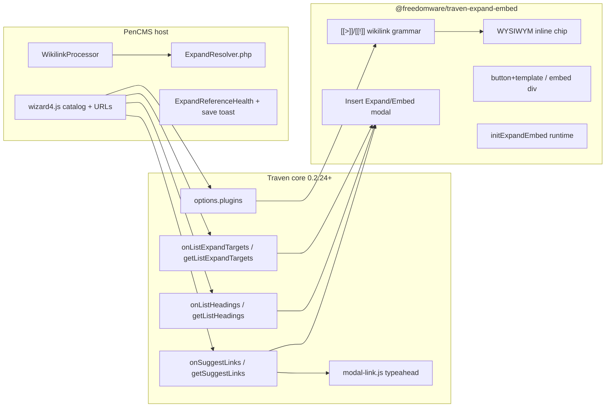

# Link suggestions & `[[>…]]` / `[[!…]]` wikilinks

Canonical reference for two related PenCMS editor features that both depend on **host knowledge of the active site’s posts**. Traven stays storage-agnostic; PenCMS owns catalogs, URLs, and published-file resolution.

| Feature | Operator / author experience | Lives in |
| :--- | :--- | :--- |
| **Link suggestions** | Insert Link modal (Mod-K) typeahead of titles/slugs | Thin Traven hook + PenCMS `wizard4.js` |
| **`[[>…]]` / `[[!…]]`** | In-place / always-on transclusion of another post | `traven-expand-embed` plugin + PenCMS resolver / WikilinkProcessor |

**Docs index:** This file is the canonical operator/agent reference. API option tables live in [`AI-and-TravenEditor-API-reference.md`](dev/AI-and-TravenEditor-API-reference.md). Host-vs-editor philosophy: [`AI-MCP-Traven.md`](dev/AI-MCP-Traven.md).

---

## Architecture (three layers)



**Do not** put PenCMS slug catalogs or expand grammar into the shared `traven.js` bundle. Other Traven consumers must remain unaffected when hooks/plugins are omitted.

---

## 1. Link suggestions

### Operator UX

1. Open the content editor (`admin-editor.php`).
2. Press **Mod-K** or click the Link toolbar button.
3. Type in the **URL** field (title or slug). Suggestions appear for **published** entries on the active Content site.
4. Pick a row → URL fills with the **slug** (and Link Text if empty). External URLs still work by typing freely.

### Expand / Embed toolbar (opt-in)

When the expand-embed plugin tools are registered, PenCMS appends **Expand** (acorn) and **Embed** (paperclip) after Link on the **main toolbar**:

1. Click Expand or Embed.
2. Type a title/slug in **Post / page** — same `onSuggestLinks` typeahead as Link.
3. Optionally choose a **Target** from the dropdown (Whole post | Summary if summary non-empty | Deck if deck non-empty | sections from `onListExpandTargets`). Without that hook, falls back to **Heading** via `onListHeadings` (Whole post + sections) or free-text.
4. Insert → `[[>slug|label]]` / `[[!slug#Heading]]` / `[[>slug^summary|label]]` / `[[>slug^deck|label]]`.

The **selection bubble** opts in **Expand only** after Link (via Traven `bubbleToolbar`). Embed stays on the main toolbar — it is a different authoring action and is not shown on the bubble.

Other Traven hosts never see these buttons unless they load `expandEmbedTools` and list the keys in `toolbar` / `bubbleToolbar`.

### Traven contract (generic)

Requires **Traven ≥ 0.2.24** and **expand-embed ≥ 0.1.12** for the Target dropdown with Summary + Deck (vendored at `frontend-php/public/assets/vendor/traven/`). Heading-only dropdown works from Traven ≥ 0.2.21 / expand-embed ≥ 0.1.9 via `onListHeadings`. Link suggest alone works from Traven ≥ 0.2.17 / expand-embed with `onSuggestLinks`.

```js
import { TravenEditor, DEFAULT_BUBBLE_TOOLBAR, registerTools } from './traven.js';
import { expandEmbedTools, EXPAND_EMBED_TOOLBAR } from './expand-embed.js';

registerTools(expandEmbedTools);

const bubble = [...DEFAULT_BUBBLE_TOOLBAR];
const i = bubble.indexOf('link');
bubble.splice(i + 1, 0, 'expand'); // Expand only on bubble

new TravenEditor({
  element,
  toolbar: [/* … */, 'link', ...EXPAND_EMBED_TOOLBAR, /* … */],
  bubbleToolbar: bubble,
  onSuggestLinks: async (query) => {
    // return [{ title, url, slug? }, ...]
    return [];
  },
  onListHeadings: async (slug) => {
    // return [{ title, level? }, ...] for Heading <select> (fallback)
    return [];
  },
  onListExpandTargets: async (slug) => {
    // preferred: { summary?: string|null, deck?: string|null, headings: [{ title, level? }, ...] }
    return { summary: null, deck: null, headings: [] };
  },
});
```

- Absent `onSuggestLinks` → classic text + URL modal (other hosts unchanged).
- Absent `onListExpandTargets` → falls back to `onListHeadings` (sections only, no Summary/Deck).
- Absent both → Heading stays a free-text input.
- `editor.getSuggestLinks()` / `editor.getListHeadings()` / `editor.getListExpandTargets()` mirror `getUploadHandler()`.
- Omit `bubbleToolbar` → default bubble (no Expand) for other consumers.

See also: [`AI-and-TravenEditor-API-reference.md`](dev/AI-and-TravenEditor-API-reference.md).

### PenCMS wiring

| Piece | Role |
| :--- | :--- |
| [`wizard4.js`](../../frontend-php/src/admin/js/wizard4.js) `_suggestLinks` | Filters `api.listPages()` / Alpine `store.pages` to **published**; returns `{ title, url: slug, slug }` so Insert Link writes `[title](slug)`. Preview/static resolvers expand the slug later. |
| [`wizard4.js`](../../frontend-php/src/admin/js/wizard4.js) `_listExpandTargets` / `_listHeadings` | Summary and/or Deck (if non-empty) + H1–H3 (+ composite partial titles) for the Target dropdown; headings-only fallback. |
| [`store.js`](../../frontend-php/src/admin/js/store.js) `getPageExpandTargets` / `getPageHeadings` / `extractPageHeadings` | Shared parse used by the modal and AI `list_page_headings`. |
| Main + partial editors | Both pass `onSuggestLinks`, `onListExpandTargets`, `onListHeadings`, `toolbar` (Expand+Embed), and `bubbleToolbar` (Expand only after Link). |

**v1 product default:** published-only. Drafts are not suggested. Cap: 12 results. Client-side substring match on title + slug (no dedicated search API yet).

### Related: AI already suggests links

The AI sidebar tool `suggest_internal_links` ([`ai-sidebar.js`](../../frontend-php/src/admin/js/ai-sidebar.js)) searches the catalog and proposes links in chat. Link-modal typeahead is the **keyboard/operator** path for the same site knowledge. Unifying or extending both for MCP is the planned next step (see below).

---

## 2. `[[>…]]` / `[[!…]]` wikilinks

Site-only transclusion (Nutshell-like): authors reference another post by **slug** (stable filename). No cross-site / CORS embedding. Extras parse left-to-right after the slug: `#Heading` slices a section, `^summary` / `^deck` selects a frontmatter nutshell, first `|` starts the label.

### Author syntax

```markdown
[[>the-spark-that-lit-nanterre|the spark]]
[[>the-spark-that-lit-nanterre#The Spark that lit Nanterre|Click for more]]
[[>christmas-in-finland^summary|Finland]]
[[>christmas-in-finland^deck|Finland]]
[[>the-spark-that-lit-nanterre|the spark]]
[[!the-spark-that-lit-nanterre]]
[[!other-post#Section]]
```

| Part | Meaning |
| :--- | :--- |
| `slug` | Load-bearing id (entry filename / id). |
| `\|label` | Optional **visible link/chip label** (independent of section). |
| `#Heading` | Optional **section** within the target (or composite partial title/id) — does not set the link label when a label is present. |
| `^summary` / `^deck` | Optional body source. `^summary` uses frontmatter `summary`; `^deck` uses frontmatter `deck`. Each appends an inline **Read more** link (same URL rules as wikilink hrefs: `post.php?slug=…` in preview, `{basePath}{slug}/` in static; `target="_blank"` `rel="noopener"`). Empty chosen field → silent omit (no cross-field or whole-post fallback). Do **not** combine with a heading. |

**Label resolution** (expand trigger + editor chip): text → `heading` → post `hero_title`/`name`/`title` (PHP) → `slug`.

| Form | Reader behavior |
| :--- | :--- |
| `[[>…]]` | Collapsed by default → inline `<button class="traven-expand-trigger">` + `<template>` body; `initExpandEmbed()` inserts a bordered panel **immediately after the trigger** (next line under the link, with a callout arrow; trailing `.`/`,` after the `<template>` stay with the trigger; no `<details>` / chevron). |
| `[[!…]]` | Always visible → `<div class="traven-embed">`. |

### Failure modes

| Case | Reader | Author |
| :--- | :--- | :--- |
| Slug missing / unpublished / future `publish_at` | **Silent omit** (empty) | Save toast warns (client catalog); `ExpandReferenceHealth` (wikilink scan) for server-side checks |
| Heading missing but slug OK | **Whole-post fallback** | Prefer fixing the heading; not treated as hard fail |
| `^summary` but empty / missing summary | **Silent omit** (no deck / whole-post fallback) | Fill Summary in the editor |
| `^deck` but empty / missing deck | **Silent omit** (no summary / whole-post fallback) | Fill Deck in the editor |
| source + heading together | **Silent omit** | Use one or the other |
| Unknown `^source` | **Silent omit** | Only `^summary` or `^deck` |

Recursion: nested expand/embed resolves up to **depth 2**, then stops (cycle / fan-out guard).

### Editor (WYSIWYM)

- Package: `@freedomware/traven-expand-embed` → vendored as  
  `frontend-php/public/assets/vendor/traven/expand-embed.js` (+ `.css`, + `expand-embed-runtime.js` for public pages).
- Loaded in [`_admin-head.php`](../../frontend-php/src/admin/includes/_admin-head.php); exposes `window.ExpandEmbedPlugin`, `window.expandEmbedTools`, `window.EXPAND_EMBED_TOOLBAR`, `window.DEFAULT_BUBBLE_TOOLBAR`, and calls `registerTools(expandEmbedTools)`.
- `wizard4.js` passes `plugins: [new ExpandEmbedPlugin({ resolve: null })]`, `extraTools`, `toolbar` with Expand+Embed after Link, and `bubbleToolbar` with **Expand only** after Link.  
  Editor shows an **inline link-like chip** (label → `heading` → slug); **public/preview PHP** resolves real HTML (avoids duplicating host render in the browser).
- Insert modals: **Link Text** (pre-filled from selection), Post/page typeahead, **Target** dropdown when `onListExpandTargets` is set (Whole post | Summary if summary non-empty | Deck if deck non-empty | sections); otherwise Heading via `onListHeadings` or free-text. Typeahead pick fills Link Text from the post title when empty.

### Public / static render (host)

| File | Role |
| :--- | :--- |
| [`ExpandResolver.php`](../../frontend-php/src/core/ExpandResolver.php) | `slug` (+ optional heading or `^deck`/`^summary` source) → published HTML; nutshell branch appends Read more; `resolveDisplayTitle()` for label fallback (`hero_title` → `name` → `title`). |
| [`WikilinkProcessor.php`](../../frontend-php/src/core/WikilinkProcessor.php) | Matches `[[>…]]` / `[[!…]]` / `[[…]]` before Markdown→HTML; validates source/heading combos; builds phrasing-safe expand trigger+template / embed `<div>` wrappers / real-href links. |
| [`ExpandReferenceHealth.php`](../../frontend-php/src/core/ExpandReferenceHealth.php) | Scan markdown for broken refs (`check($markdown, $siteId)`). |
| Theme heads | Load `expand-embed.css` + `expand-embed-runtime.js` (`initExpandEmbed` auto-runs) — starter, editorial, casper-lite (and archived trees under `themes/_deprecated/`). |

Site scope follows ThemeEngine / `InternalAPIClient($siteId)` — same firewall as the rest of multisite preview.

### Plugin resolver interface (when host wants editor-time HTML)

```js
new ExpandEmbedPlugin({
  resolve({ slug, heading, source, mode }) {
    // return HTML string, or null → omit
    return null;
  },
});
```

PenCMS admin currently passes `resolve: null` and relies on PHP at publish/preview.

### Traven plugin registration (generic)

Requires Traven **0.2.17+** `options.plugins`:

```js
import { TravenEditor, TravenPlugin, Decoration, WidgetType, syntaxTree } from './traven.js';
import { ExpandEmbedPlugin } from './expand-embed.js';

new TravenEditor({
  element,
  plugins: [new ExpandEmbedPlugin({ resolve: hostResolve })],
});
```

Host plugins may implement: `getMarkdownConfig()`, `buildDecorations()`, `getKeymap()`, `getExtensions()`, `onRegister()`, `renderToHTML()`.  
`renderMarkdown(text, extraPlugins)` accepts the same plugins for standalone compile.

Source package (Traven monorepo): `traven/packages/expand-embed/`.

---

## 3. Vendor / version map

| Asset | Path under PenCMS |
| :--- | :--- |
| Traven core | `frontend-php/public/assets/vendor/traven/traven.js` (+ `traven.css`) |
| Expand plugin | `…/expand-embed.js` (+ `expand-embed.css`, `expand-embed-runtime.js`) |
| Rebuild from | `traven/packages/core` → copy dist; `traven/packages/expand-embed` → copy dist, rewrite import `@freedomware/traven` → `./traven.js` in `expand-embed.js` |

Do **not** hand-edit the minified vendor bundle.

---

## 4. AI Assistant + MCP tools

Expand/embed remain **plain Markdown wikilinks** (PHP/Traven render). PenCMS now ships first-class tools so agents suggest, insert, and validate them without improvising syntax.

### AI sidebar (`ai-sidebar.js`)

| Tool | Role |
| :--- | :--- |
| `suggest_internal_links` | Live-published catalog (status + `publish_at`); optional FTS merge. Returns `suggested_text`, `markdown_link`, `wikilink`, `usage_hint`. |
| `insert_expand_embed` | Builds `[[>…]]`/`[[!…]]`, refuses unpublished slugs, inserts via selection/cursor. Accepts optional `source: "summary"` or `source: "deck"`; rejects `source` + `heading` together. |
| `list_page_headings` | H1–H3 (+ composite partial titles) for real `heading=` values. |
| `check_expand_refs` | Flags missing/unpublished expand targets in the open doc or a markdown string. |

Shared catalog: `Alpine.store('app').getPublishedLinkCatalog()` (also warms on editor init; powers typeahead + save warn). Target dropdown: `getPageExpandTargets` / `getPageHeadings` / `extractPageHeadings` (shared with AI `list_page_headings`).

**Workflow:** Nutshell request → `suggest_internal_links` → (optional) `list_page_headings` for a section, or `source: "summary"` / `source: "deck"` for a nutshell → `insert_expand_embed` → optional `check_expand_refs`. Normal links still use `[text](slug)` — expand is not forced.

### MCP gateway

| Tool | Role |
| :--- | :--- |
| `suggest_internal_links` | Same enrich shape; `query` required; live_only listing. |
| `check_expand_refs` | `{ markdown? }` or `{ slug? }` — validates target slugs. |

Insert from MCP via `write_content_file` with the shortcode string (no cursor). See [`mcp_guide.md`](./mcp_guide.md).

Principles (unchanged from [`AI-MCP-Traven.md`](dev/AI-MCP-Traven.md)):

- MCP and AI tools stay in **PenCMS**, not Traven core.
- Agents insert plain Markdown (`[text](url)` or `[[>slug|label]]`); Traven/PHP render as today.
- Respect active site (`X-Pen-Site-Id` for human MCP; JWT `site_id` for agents).

---

## 5. Quick smoke checklist

1. **Link suggest:** Editor → Mod-K → type a published title → pick → Insert → markdown link uses bare slug (`[Title](slug)`). Typeahead list is fully visible (not clipped by the modal).
2. **Expand chip + Link Text:** Select a word → Expand (main toolbar **or** selection bubble) → Link Text pre-filled; insert writes `[[>slug|text]]`. Chip/trigger show the label, not the slug. Bubble shows Expand after Link and **does not** show Embed; main toolbar still has both Expand and Embed.
3. **Target dropdown (Summary / Deck):** Expand → pick a published post with non-empty Summary and/or Deck → Target lists Whole post | **Summary** (if summary set) | **Deck** (if deck set) | sections. Summary writes `^summary`; Deck writes `^deck`. Both fields set → both rows. Published page shows the chosen field HTML with an inline **Read more** link (preview: `post.php?slug=…`; static: relative slug path). Empty chosen field → that row absent; matching source silently omits on the reader (no cross-fallback).
4. **Heading / section:** Choosing a section still writes `#Heading` (no source). Heading miss → whole-post fallback (unchanged).
5. **AI `source`:** `insert_expand_embed` with `source: "summary"` or `source: "deck"` emits the matching suffix; combining with `heading` returns an error.
6. **Broken ref:** `[[>does-not-exist|label]]` → empty on public; save shows warning toast in admin.
7. **Draft target:** Unpublished slug → not in link suggestions; expand omits on public.
