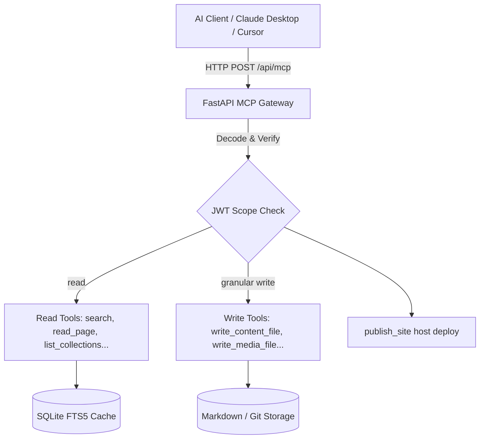

# Model Context Protocol (MCP) Guide for PenCMS

PenCMS features built-in support for the **Model Context Protocol (MCP)**, exposing the CMS's content management capabilities directly to external AI agents (such as Claude Desktop, Cursor, or custom autonomous agents). 

By connecting your AI agent to the PenCMS MCP gateway, you allow the agent to read pages, list collections, browse media, run high-performance full-text search, and write or update content securely using Role-Based Access Control (RBAC).

---

## Architecture Overview

PenCMS implements MCP over the modern **Streamable HTTP** transport. 



### 1. Agent Keys & RBAC Scopes
Security is anchored on static **Agent Keys** (`pen-sk-...`) created in the admin panel. Each key is bound to:

*   A **site** (`site_id`) — one key ↔ one site by default (e.g. name `blog-cursor` on site `blog`). Content tools only read/write that site’s tree under `content/sites/{site_id}/`.
*   A scope set (humans and agents share this vocabulary; expansion is check-time only):
    *   `read`: Search, list, inspect content/media/menus/theme/presentation. Monolithic — no `read:posts`.
    *   `write:posts` / `write:pages`: Create+update posts vs pages. Same tools (`write_content_file`, translation siblings, split/merge/move). Distinguished by frontmatter `page: true`. Create uses the request body; update/delete uses the **existing** document. Flipping `page` → 403 `cannot_change_page_kind`.
    *   `delete:posts` / `delete:pages`: Delete (MCP: `delete_translation_sibling` only; no MCP delete-page tool).
    *   `write:media`: Upload / generate media.
    *   `publish:content`: Content status / translation review (`review_translation_sibling`). **Not** host deploy. Generic `write_content_file` status edits stay under `write:posts` / `write:pages` plus site `ai_publish_autonomy`.
    *   `write:menus` / `write:authors` / `write:seo` / `write:theme` / `write:taxonomy`: Menus (incl. item delete), authors.yaml, site presentation, theme fork edits, vocabularies + terms (`taxonomy.yaml`). Not collections.yaml / Publishing Rules.
    *   `write` **(legacy)**: One-way expansion to every `write:*`, every `delete:*`, and `publish:content`. Does **not** imply host `publish`, `users:manage`, or `manage:sites`. `write:posts` alone does **not** expand to `write` or `write:theme`.
    *   `publish`: Host deploy of static `dist/` (`publish_site`; Deploy Grant required). Legacy `write` does **not** imply this. `publish:content` ≠ `publish`.
    *   `commit_and_push` / `report_translation_run` still require the stored legacy `write` alias (no granular git/telemetry cap in v1).

There is still **one** MCP connector URL / JWT `aud` (`MCP_RESOURCE_URL`) for the whole install. Site isolation is the key’s `site_id` claim, not a separate OAuth resource per site.

**Human admin** (browser session / AI sidebar): the operator picks an active content site in the admin header. That preference is sent as `X-Pen-Site-Id` (and stored in the `pen_site_id` cookie). Human MCP cookie sessions honor the same header/cookie so the editor and AI tools stay on the same site. Agent JWTs are **not** overridden by this header.

MCP clients receive short-lived JWTs (default **15 minutes**) bound to `iss` / `aud` for the MCP resource, `site_id`, the display `agent_key_name`, and an immutable non-secret `agent_key_id`. OAuth codes/refresh tokens bind to the immutable ID, so revoking and recreating the same name cannot revive the old grant. Interactive clients (Cursor, Claude Custom Connectors) obtain tokens via **OAuth** (admin consents by picking an existing agent key — labels show `site · name`). Scripts and CI use the **automation** agent-key exchange below.

Set these environment variables so token audience and discovery URLs match the public site:

*   `JWT_ISSUER` — absolute authorization-server issuer URL (e.g. `https://cms.example`)
*   `MCP_RESOURCE_URL` — absolute MCP gateway URL (e.g. `https://cms.example/api/mcp`)
*   `JWT_SECRET` — HS256 signing secret (set a long random value in production)
*   `AGENT_TOKEN_EXPIRE_MINUTES` — access-token lifetime in minutes (default `15`)
*   `CORS_ALLOW_ORIGINS` — comma-separated admin UI origins (default `http://127.0.0.1:8009,http://localhost:8009`); production must list the public admin origin(s). Non-browser MCP agents omit `Origin` and are unaffected.
*   `PENCMS_RATE_LIMIT_MCP` — agent MCP loop-guard (default on). Set `0` to disable. Counts Bearer agent JWTs on `/api/mcp` and `/api/v1/mcp/*` only; human admin cookie sessions are not counted. This is in-process (resets on restart, not shared across workers) — Caddy still owns connection floods.
*   `PENCMS_RATE_LIMIT_MCP_PER_MIN` — sliding-window ceiling per agent key (default `120`). Over-limit responses are `429` with `Retry-After` and `X-RateLimit-*`.

Machine-readable MCP discovery: `GET /llms.txt` (also in-repo at [`core/docs/llms.txt`](./llms.txt)). This install-level endpoint describes the MCP gateway; it is distinct from each statically published site's generated, default-language-only `llms.txt`. Product direction: [`product_thesis.md`](./product_thesis.md). Agent-owned site (human sponsor, agent editor): [`agent-owned-site.md`](./agent-owned-site.md). Host deploy (humans + agents): [`publish-howto.md`](./publish-howto.md), [`publish-agents.md`](./publish-agents.md).

---

## Setup Guide

### Step 1: Generate an Agent Key
OAuth consent and automation both require at least one agent key. Operator How-To (humans + keys, presets, revoke): [`users-and-access.md`](./users-and-access.md).

1. Log into the PenCMS Admin Panel.
2. Navigate to **Settings** → **AI** (Agent Keys panel). Only **install admins** can mint keys.
3. Unlock the Zero-Knowledge Vault if prompted.
4. Enter a **name** for the agent (globally unique per operator), e.g. `blog-cursor` or `wiki-claude`. Prefer `{site}-{agent}` labels; choose the **Site** in the picker (defaults to `default` for single-site operators). Create sites under **Settings → Sites** if needed.
5. Select a **preset** (Read-Only, Writer, Editor, Publisher, or the legacy Read+Write / Read+Write+Publish bundles) or tick **Custom** and pick granular scopes. Writer/Editor/Publisher include `read` so the agent can list and search. Host deploy still needs `publish` plus a Deploy Grant.
6. Click **+ Generate New Key** and copy the generated `pen-sk-…` token immediately (needed for automation; OAuth consent only needs the key to exist in the list).

API: `POST /api/auth/keys` with `{"name":"blog-cursor","scopes":["read","write:posts","write:pages"],"site_id":"default"}`. Legacy `["read","write","publish"]` still works via one-way expansion (`write` ≠ host `publish`). List sites with `GET /api/sites`; create with `POST /api/sites`.

**Host deploy (agentic):** enroll a Deploy Grant on **Publish → Settings** (“Allow agents to publish to this host”). Password hosts copy the SFTP password into install-decryptable server storage (leaves ZK for that secret). Key-auth hosts enroll as flag-only (install Ed25519). Agents never receive host passwords — they call `publish_site` / `POST /api/publish/run` with scope `publish`. Step-by-step (hybrid vignette, revoke knobs): [`publish-agents.md`](./publish-agents.md). Human UI first publish: [`publish-howto.md`](./publish-howto.md).

**Reassign site without reminting:** `PATCH /api/auth/keys/{index}` with `{"site_id":"docs"}`. The secret (`pen-sk-…`) is unchanged. **Existing JWTs keep the old `site_id` claim until they expire** (default ~15 minutes); call `POST /api/auth/token` again (or OAuth refresh) to mint a token with the new binding. Admin UI: AI → Agent Keys → Site dropdown + Save.

At OAuth consent, the admin picks a key; the dropdown shows `site · name (scopes)`.

### Step 1b: Agent-assisted bootstrap (approve-code)

Agents can request a named, site-bound key without the human pasting a secret into chat. The human still sponsors issuance (no root password for the agent):

1. Agent: `POST /api/auth/agent/request-code` with `{"name":"blog-cursor","scopes":["read","write"],"site_id":"default"}` → receives `user_code` (8 chars, ~10 min TTL).
2. Agent asks the human to approve that code in **Settings → AI → Agent Keys → Pending approvals**.
3. Admin clicks **Approve** (or `POST /api/auth/agent/approve` with `{"user_code":"…"}`).
4. Agent: `POST /api/auth/agent/verify-code` with `{"user_code":"…"}` → if still pending, `202`; once approved, receives `pen-sk-…` **once**. Store it with restrictive permissions (e.g. `~/.pencms/credentials` mode `0600`).
5. Then use Step 3 automation (`POST /api/auth/token`) or OAuth consent against the new named key.

Deny with `{"user_code":"…","deny":true}`. This complements OAuth for Custom Connectors; it does not replace it.

### Step 2: Custom Connector (OAuth) — Cursor / Claude

This is the primary path for stock MCP clients. PenCMS is a remote MCP server on Streamable HTTP (`/api/mcp`). Point the connector at your public `MCP_RESOURCE_URL`.

**Discovery flow:**

1. Client hits `/api/mcp` without a bearer → `401` with `WWW-Authenticate` including `resource_metadata`.
2. Client fetches PRM: `GET /.well-known/oauth-protected-resource` (path-qualified variant: `/.well-known/oauth-protected-resource/api/mcp`).
3. Client fetches AS metadata: `GET /.well-known/oauth-authorization-server`.
4. Client runs PKCE (S256) against `/oauth/authorize` → `/oauth/token`, with `resource` equal to `MCP_RESOURCE_URL`.
5. At consent, an admin logs in and **picks an existing agent key**; granted scopes are a subset of that key’s scopes.
6. Client calls `/api/mcp` with `Authorization: Bearer <access_token>`.

**Client identity (no DCR):** PenCMS does **not** support Dynamic Client Registration — there is no `/oauth/register`. Clients identify via **Client ID Metadata Documents (CIMD)** as the primary path (HTTPS URL as `client_id`, fetched for `redirect_uris`), or the static allowlist (`pencms-dev` by default; override with `OAUTH_STATIC_CLIENTS`).

**RFC 9207 `iss`:** Authorization success and error redirects to the client include `iss` equal to `JWT_ISSUER`. Clients must validate `iss` before redeeming the authorization code. AS metadata advertises `authorization_response_iss_parameter_supported: true`.

**Claude (Custom Connectors)**

1. Open Claude → **Settings → Connectors** → **Add custom connector**.
2. Enter the MCP endpoint, e.g. `https://cms.example/api/mcp` (must match `MCP_RESOURCE_URL`).
3. Complete the OAuth authorize / consent flow in the browser (pick an agent key).
4. After connection, configure which tools the connector may use.

**Cursor** — add a remote MCP / Custom Connector pointing at the same `MCP_RESOURCE_URL` and complete the same OAuth discovery + consent flow.

> **Note (custom clients):** Send `MCP-Protocol-Version: <version>` (e.g. `2025-06-18`) after initialization; echo any `Mcp-Session-Id` the server returns. OAuth-minted and automation JWTs are both valid bearer credentials for `/api/mcp`. Scripts that skip the session header on `tools/list` / `tools/call` get **400** `mcp_session_required`. Session-free alternative: REST `/api/v1/mcp/*` with the same Bearer.

### Step 3: Automation (agent key) — scripts / CI

For non-interactive agents, exchange an agent key for a JWT (no browser OAuth):

```http
POST /api/auth/token
Content-Type: application/json

{
  "agent_key": "pen-sk-your-secret-key-here"
}
```

```bash
curl -X POST https://cms.example/api/auth/token \
  -H "Content-Type: application/json" \
  -d '{"agent_key": "pen-sk-your-copied-key"}'
```

Response:

```json
{
  "access_token": "eyJhbGciOi...",
  "token_type": "bearer"
}
```

Use `Authorization: Bearer <JWT>` on subsequent `/api/mcp` calls. Capture `Mcp-Session-Id` from `initialize` and send it on every later JSON-RPC POST. Without it, authenticated `tools/list` is **400** (not a vague “not initialized”). REST `/api/v1/mcp/*` does not use a session.

```bash
CMS_ORIGIN="https://cms.example"
TOKEN="$(curl -fsS "$CMS_ORIGIN/api/auth/token" \
  -H 'Content-Type: application/json' \
  --data-binary "{\"agent_key\":\"$PENCMS_AGENT_KEY\"}" |
  python3 -c 'import json,sys; print(json.load(sys.stdin)["access_token"])')"

INIT="$(curl -fsS -D - -o /tmp/pencms-mcp-init.json \
  -X POST "$CMS_ORIGIN/api/mcp" \
  -H "Authorization: Bearer $TOKEN" \
  -H 'Content-Type: application/json' \
  -H 'Accept: application/json, text/event-stream' \
  --data-binary '{"jsonrpc":"2.0","id":1,"method":"initialize","params":{"protocolVersion":"2025-06-18","capabilities":{},"clientInfo":{"name":"curl","version":"0"}}}')"
SESSION="$(printf '%s\n' "$INIT" | awk -F': ' 'BEGIN{IGNORECASE=1} /^mcp-session-id:/{gsub(/\r/,"",$2); print $2; exit}')"

curl -fsS -X POST "$CMS_ORIGIN/api/mcp" \
  -H "Authorization: Bearer $TOKEN" \
  -H "mcp-session-id: $SESSION" \
  -H 'Content-Type: application/json' \
  -H 'Accept: application/json, text/event-stream' \
  --data-binary '{"jsonrpc":"2.0","id":2,"method":"tools/list","params":{}}'
```

Stock connectors (Cursor, Claude) already persist the header. LAN `--reload` drops in-memory sessions — see [`lan_https.md`](./lan_https.md).

Do **not** mint a new token or call `initialize` for every tool. One shell, one JWT, one `Mcp-Session-Id`. Start with `GET $CMS_ORIGIN/llms.txt`. Single YAML field (e.g. `deck`) → `update_frontmatter_field`; do not read this git tree to learn how writes work.

### External translation runs (cron or agent)

PenCMS exposes file-backed translation primitives; it does **not** run a model,
schedule jobs, maintain a queue, or orchestrate translation. An external cron
script or MCP client owns that loop:

1. Mint a short-lived JWT from a named, site-bound key with `read` + `write`.
   The key name is propagated into content/run provenance.
2. Call `get_translation_config`. Stop when `i18n_active` is false or
   `translation_automation_paused` is true. When `automation_policy.enabled` is
   true, select a target assigned to this key and use its exact `operation` and
   non-secret `model` identifier. A run may combine targets only when their
   operation, model, key binding, and review policy are identical.
3. Call `report_translation_run` without `run_id` to start body-free telemetry,
   passing the selected operation as `mode` and the exact target tags.
4. Call `list_translation_gaps`; fallback rows are presentation-only and never
   count as coverage.
5. Produce translated text outside PenCMS, then call
   `create_translation_sibling` for missing exact locales or
   `write_content_file` with `language` for an existing sibling. Agent writes
   honor site `ai_publish_autonomy` (same as default-language posts). When
   `automation_policy.enabled` is true, both calls
   must include the active `run_id`; runless writes and keys not bound to that
   target are rejected. Sibling deletion does not need a run, but still requires
   the target's bound key. Agent writes stamp `needs_review` by default; an explicit
   target policy may use `allow_unreviewed_draft` to omit the review flag. That
   flag is not publish authority — Autonomous agents set `status: published` on
   the write. Human Approve also publishes (one decision).
6. Call `report_translation_run` with the returned `run_id`, final counts, and
   `run_status: completed|failed|cancelled`.

The optional policy is stored beside other non-secret site AI guardrails in
`data/ai-settings/{site}.json`:

```json
{
  "i18n_localization_policy": {
    "enabled": true,
    "targets": {
      "fr": {
        "operation": "translate",
        "model": "provider/localizer-v1",
        "agent_key_id": "ak_0123456789abcdef01234567",
        "review_policy": "require_review"
      },
      "sr-latn": {
        "operation": "translate_then_transliterate",
        "model": "provider/script-aware-v2",
        "agent_key_id": "ak_0123456789abcdef01234567",
        "review_policy": "require_review"
      }
    }
  }
}
```

Configure this through **Translations → Languages**, not by writing the JSON.
Targets must be configured non-default BCP-47 tags, and script variants use
distinct tags such as `sr-latn` and `sr-cyrl`. The model value is an identifier
for the external caller; provider API keys and other credentials never enter
the policy or run log. Keep provider credentials in the PenCMS vault for
human-side integrations or in the cron/agent host's secret store.

Run history is bounded at `data/i18n-runs/{site}.jsonl`. It contains IDs,
named actor, mode, target tags, non-secret model/key policy snapshot, review
policy, timestamps, status, counts, and sanitized errors—never translated
bodies, prompts, credentials, or model output. Pausing a site rejects new agent
sibling writes/deletes and run starts; human/manual writes continue. Revoking
the named key invalidates its binding and stops new translation writes and run
starts even for an already-minted JWT.

Human operators approve/reject through the same shared review service. The MCP
`review_translation_sibling` tool is visible for parity and human MCP
debugging, but agent tokens cannot self-review. Autonomous agents go live by
setting `status` on `write_content_file` / sibling create, not by approving
themselves. The Slice 10 review policy controls only whether a draft carries
`needs_review`; it never grants publish authority — that is `ai_publish_autonomy`.
Human Approve publishes. REST reviews may include an optional `note`, which is stored
as server-owned `review_note` provenance in the Markdown sibling.

#### Self-hosted cron skeleton

The scheduler stays outside PenCMS. For example, an operator can keep this
sequence in a local script invoked by system cron:

```bash
#!/usr/bin/env bash
set -euo pipefail

CMS_ORIGIN="https://cms.example"
TOKEN="$(curl -fsS "$CMS_ORIGIN/api/auth/token" \
  -H 'Content-Type: application/json' \
  --data-binary "{\"agent_key\":\"$PENCMS_AGENT_KEY\"}" |
  python -c 'import json,sys; print(json.load(sys.stdin)["access_token"])')"

curl -fsS "$CMS_ORIGIN/api/v1/translations/config" \
  -H "Authorization: Bearer $TOKEN"

# The external client now selects a compatible target policy, starts a run via
# report_translation_run (or POST /api/v1/translations/runs), discovers exact
# gaps, calls its configured model, writes drafts with run_id, and finishes the
# same run. Keep PENCMS_AGENT_KEY and provider credentials in the cron host's
# secret environment; never place them in ai-settings JSON or JSONL telemetry.
```

The script intentionally stops before model-specific code: PenCMS defines the
policy and write/report contracts, while the operator's chosen MCP client owns
prompting, retries, rate limits, and schedule.

### Published i18n output policy

After content siblings are published, a static publish or dynamic request uses
the same site-scoped, file-backed visibility rules:

- `/sitemap.xml` retains every default-language URL and adds only exact,
  live-published sibling URLs under `/<lang>/<slug>/`.
- Search-index documents include `lang` only while site i18n is active; merged
  localized indexes report each exact or fallback row's actual language.
- Public-site RSS and generated public-site `llms.txt` deliberately remain
  default-language-only in i18n v1. Agents must not invent localized feed or
  `llms.txt` URLs.
- The API's install-level `GET /llms.txt` remains MCP discovery, not a localized
  content feed and not one of the per-site static files above.

#### Custom Agent (Python)

```python
from mcp import ClientSession
from mcp.client.http import http_client

async with http_client("https://cms.example/api/mcp", headers={"Authorization": "Bearer YOUR_JWT"}) as (read, write):
    async with ClientSession(read, write) as session:
        await session.initialize()
        tools = await session.list_tools()
        print(tools)
```

---

## Deployment notes

*   **VPS / public HTTPS (Compose):** FastAPI + Caddy TLS, env checklist, first-agent path — [`deploy_compose.md`](./deploy_compose.md) (`deploy/` in the repo).
*   **TLS + HSTS:** Terminate TLS at the reverse proxy and enable HSTS there. Remote MCP clients and browser OAuth expect HTTPS outside pure localhost.
*   **LAN home server (no cloud required):** Run PenCMS on a machine on your LAN behind HTTPS (mkcert + Caddy/Nginx/Apache), same pattern as SilverBullet-style local servers. Set `JWT_ISSUER` / `MCP_RESOURCE_URL` / `CORS_ALLOW_ORIGINS` to that HTTPS origin. Step-by-step: [`lan_https.md`](./lan_https.md).
*   **URL matching:** `JWT_ISSUER` and `MCP_RESOURCE_URL` must match the scheme, host, and path clients use (no `http` vs `https` drift; keep path `/api/mcp` exact). Well-known and `/oauth/*` URLs are derived from `JWT_ISSUER`.
*   **CORS:** Set `CORS_ALLOW_ORIGINS` to the admin UI origin(s). The PHP local `router.php` same-origin `/api` proxy does not need CORS. Non-browser MCP agents that omit `Origin` remain fine.
*   **Localhost:** Fine for same-machine curl and local agents. Cloud Custom Connectors need a URL *they* can reach (LAN+VPN/Tailscale, tunnel, or VPS) — not bare `http://127.0.0.1`.
*   **Secrets:** Set `JWT_SECRET` to a long random value in production (Compose `.env`); it signs agent JWTs.

---

## Smoke checklist (TLS deploy)

Against a production-like HTTPS install:

1. Unauthenticated `GET`/`POST` to `/api/mcp` → `401` with `WWW-Authenticate` containing `resource_metadata`.
2. `GET /.well-known/oauth-protected-resource` and `GET /.well-known/oauth-authorization-server` return JSON whose `resource` / `issuer` / endpoints match public `MCP_RESOURCE_URL` and `JWT_ISSUER` (AS metadata includes `authorization_response_iss_parameter_supported: true`).
3. Cursor or Claude Custom Connector: authorize → consent (pick agent key; label shows `site · name`) → redirect query includes `iss` matching `JWT_ISSUER` → `tools/list` succeeds.
4. Token with wrong `aud` → `401`; call requiring a missing cap (e.g. `write:posts`) → `403` + `insufficient_scope`; agent JWT without/unknown `site_id` → `403`.
5. Automation: `POST /api/auth/token` with a valid agent key still mints a bearer that can call `/api/mcp` (JWT includes `site_id`). Curl: `initialize` then echo `Mcp-Session-Id`; or use REST `/api/v1/mcp/*`. Authenticated JSON-RPC other than `initialize` without that header → `400` `mcp_session_required`.
6. Cross-site: a key bound to site A cannot read/write pages under site B.
7. `POST /oauth/register` → `404` (no Dynamic Client Registration).

---

## Tool Reference

The PenCMS MCP Gateway exposes one live tool catalog tagged with `["mcp"]`.

| Tool Name | Scope Required | Description | Key Arguments |
| :--- | :--- | :--- | :--- |
| `get_site_config` | `read` | Returns **this site's** collection schemas, taxonomy vocabulary terms, required fields, `prompts` bundle, read-only `extractive_prompts` (`summary` / `faqs`), public `sitename`, and `agent` guardrails (`ai_publish_autonomy`, `ai_metadata_scope`). Agent JWT site / human active site. | None |
| `get_site_prompts` | `read` | Returns **this site's** configured AI editorial persona (`text_generation_prompt`), visual / illustration style guidance (`image_generation_prompt`), `post_quality_checklist`, read-only `extractive_prompts.summary` / `extractive_prompts.faqs` (not operator-editable), public `sitename`, and publishing guardrails (`ai_publish_autonomy`, `ai_metadata_scope`). | None |
| `update_site_prompts` | `write` | Sparse update of AI persona, image generation styling, or quality checklist for **this site**. | `text_generation_prompt` (opt), `image_generation_prompt` (opt), `post_quality_checklist` (opt) |
| `list_themes` | `read` | Lists installable themes (directories with `theme.json`). Empty-safe; no content/menus required. Includes this site’s `custom` entry when a site theme tree exists. | None |
| `get_site_presentation` | `read` | Resolved presentation / SEO for **this site**: theme + identity, Meta, Indexing, sparse Social overrides, theme Social defaults, effective Social, branding presence hints. Works on a blank site. | None |
| `list_collections` | `read` | Lists all active content collections on the site. | None |
| `list_collection_entries` | `read` | Lists pages in a collection with exact/merged language selection. | `collection_name`, `page`, `limit`, `language`, `fallback` |
| `read_page_metadata` | `read` | Returns exact-language frontmatter, sibling metadata, and an opaque `version` token. | `slug`, `language` (optional) |
| `read_page_content` | `read` | Returns an exact-language Markdown body/partials and an opaque `version` token. | `slug`, `language` (optional) |
| `update_frontmatter_field` | `write:posts` / `write:pages` | Patch **one** YAML frontmatter field (`deck`, `summary`, `faqs`, `hero_title`, `category`, `status`, `author`, …). `faqs` is a list of `{q, a}` strings; `[]` is valid and is **not** derived from `[expand]`. Body and other keys stay on disk. Same merge, caps, and `ai_publish_autonomy` as `write_content_file`. Extractive fill does **not** need publishing autonomy (that gate is `status` only). Remote MCP only — the editor AI sidebar still uses its local form+save tool of the same name. | `slug`, `key`, `value`, optional `expected_version`, `force`, `language` |
| `search_content` | `read` | Executes site- and language-scoped FTS5 search. | `query`, `limit`, `language` (optional) |
| `get_translation_config` | `read` | Returns active/default languages, labels, pause state, and optional per-target operation/model/named-key/review policy with binding health. Never returns secrets. | None |
| `list_translation_gaps` | `read` | Returns exact coverage totals and missing/draft/review/rejected rows; fallback never counts. | `language` (optional) |
| `list_translation_runs` | `read` | Lists recent bounded, body-free external run telemetry for the bound site. | `limit` |
| `suggest_internal_links` | `read` | Suggest live-published pages (status + `publish_at`) for Markdown links or `[expand]`/`[embed]` targets. Returns `suggested_text`, `markdown_link`, `expand_shortcode`. Insert Nutshells via `write_content_file` with the shortcode string. | `query`, `limit` |
| `check_expand_refs` | `read` | Validate `[expand]`/`[embed]` target slugs in a markdown string or page body (`slug`). Flags missing/unpublished targets only (heading misses are not broken). | `markdown` and/or `slug` |
| `list_media` | `read` | Lists assets in **this site's** media library (`content/sites/{id}/assets/…`), returning logical filenames and public URLs. | None |
| `review_post` | `read` | Evaluates a post against a quality checklist using the configured LLM. Returns a structured scorecard with overall score, criteria-specific feedback, top improvements, and raw LLM text. | `slug`, `checklist` (optional), `model` (optional) |
| `get_publish_status` | `read` | Checks the status of a background git push task. | `task_id` (optional) |
| `publish_site` | `publish` | Builds and deploys this site’s static `dist/` to the configured publish host. Requires an enrolled Deploy Grant. Never returns host passwords. **Not** git commit/push — that is `commit_and_push`. Operator guide: [`publish-agents.md`](./publish-agents.md). | `{}` *(empty!)* |
| `get_publish_site_status` | `publish` | Polls a host-deploy run started by `publish_site` / `POST /api/publish/run`. | `{ "task_id"?: string }` |
| `create_post` | `write:posts` | Creates a new **empty stub** (`status: stub`, empty body). That is a bootstrap, not a publish lock. Live publish is a **later** `write_content_file` / `update_frontmatter_field` on `status`, gated by Settings → AI **Publishing autonomy** (`ai_publish_autonomy`: `autonomous` / `require_approval` / `restricted`). `require_approval` downgrades publish attempts; `restricted` blocks status entirely. Response includes `status`, `published: false`, `ai_publish_autonomy`, and a `next` hint. Derives slug from name. If that slug is taken, a UTC timestamp is appended; `name` is unchanged. **Not** a thread reply — use `create_comment`. | `name`, `category` (optional) |
| `list_comments` | `read` | List comment files beside a post (`content/sites/{id}/{post}/comments/c-*.md`). Admin payload includes `visibility`. Omit `visibility` for all states (including pending); set it to filter. Oldest-first. Unknown post → empty list. JWT `site_id` is authoritative. Public GET `/comments` stays visible-only and has no `visibility` field. | `post_slug`, optional `visibility` |
| `create_comment` | `write:posts` | Write a **visible** agent comment beside an existing post. `author_kind: agent`, `source_type: mcp`, display name = key name. Unknown `post_slug` → 400. Do **not** use `create_post` for a thread reply. Response includes `public_path` (live `/blog/post.php?slug=&section=&site=` plus `#comment` fragment) only when the parent **post** is published; otherwise `public_path` is null. Never a page, archive, index, or search URL. | `post_slug`, `body`, optional `in_reply_to` |
| `set_comment_visibility` | `write:posts` | Rewrite YAML `visibility` (`pending` / `visible` / `hidden`) on an existing comment file. Moderation, not post `status` / `ai_publish_autonomy`. Unknown comment → 404. | `comment_slug`, `post_slug`, `visibility` |
| `delete_comment` | `delete:posts` | Delete a comment file via storage (not `delete_page`). Git history remains. Unknown comment → 404. | `comment_slug`, `post_slug` |
| `sync_remote_feedback` | `write` | Drain the public feedback relay into this site (`fb-*` contact stubs and `comments/c-*.md`). Missing keys → `written: 0` / `no_relay_configured`; down relay → `relay_unreachable` (not 500). | None |
| `write_content_file` | `write:posts` / `write:pages` | **Partial frontmatter merge plus Markdown body write.** Omitted YAML keys stay on disk. Prefer `update_frontmatter_field` for one field. **`body` is required on create; omit `body` on an existing page to keep the on-disk Markdown.** Creates/updates default content or updates one existing exact sibling with `language`; sibling agent edits honor `ai_publish_autonomy` (not a hard force-to-draft). Cap from body `page` on create, **existing** doc on update. Kind flip → 403 `cannot_change_page_kind`. An enabled localization policy requires its active bound `run_id`. Optimistic concurrency: pass `expected_version` from a prior read `version`; mismatch → 409 `version_conflict` unless `force` is true. Omitted `expected_version` is an unconditional write. Status/`publish_at` stay under write:* + `ai_publish_autonomy`, not `publish:content`. | `slug`, `frontmatter`, `body` (optional on update), `composite`, `partials`, `expected_version`, `force`, `language`, `run_id` | `run_id` |
| `create_translation_sibling` | `write:posts` / `write:pages` | Atomically creates one exact non-default draft sibling; assigns group and named-actor provenance; conflicts rather than overwrites. Cap from the existing default document. An enabled localization policy requires its active bound `run_id`. | `slug`, `language`, `collection`, localized fields, `run_id` |
| `delete_translation_sibling` | `delete:posts` / `delete:pages` | Deletes one exact non-default sibling only; an enabled policy requires the target's bound key. Cap from the existing default document. | `slug`, `language`, `collection` |
| `review_translation_sibling` | `publish:content` | Approve/reject through shared publication rules. Approve **publishes**. Agent tokens cannot self-review (Autonomous agents set `status` on write instead). Not host deploy. | `slug`, `language`, `decision` |
| `report_translation_run` | `write` (legacy) | Starts/updates external, bounded, body-free telemetry; enabled policy validates operation/targets/key and snapshots non-secret model/review metadata. It does not schedule or execute translation. Requires stored `write` (no granular telemetry cap). | `run_id`, `mode`, `target_languages`, `run_status`, `counts`, `error` |
| `write_media_file` | `write:media` | Uploads a media asset via Base64 into **this site's** assets tree. Guarded against directory traversal. | `filename`, `content_base64` |
| `generate_media` | `write:media` | Generates an image via the configured AI provider and stores it in **this site's** media library. Returns `relative_path` / `use_for_embedding` (copy into `[image src="..."]` and frontmatter like `hero_image` — never invent filenames) and `public_url` (chat preview only). | `prompt`, `filename`, `preset` (optional), `alt_text` (optional) |
| `split_section` | `write:posts` / `write:pages` | Splits a section or text of a page into a new child fragment, converting the page into a composite document. Cap from the existing document. | `slug`, `source_slug`, `new_fragment_slug`, `split_marker` (optional) |
| `merge_sections` | `write:posts` / `write:pages` | Merges one or more child fragments back into a target fragment or the main index of a composite page. Cap from the existing document. | `slug`, `fragment_slugs`, `into_slug` |
| `move_section` | `write:posts` / `write:pages` | Reorders sections (articles/fragments) within a composite page. Cap from the existing document. | `slug`, `heading_path`, `before_or_after`, `target_heading_path` |
| `commit_and_push` | `write` (legacy) | Stages, commits, and optionally pushes content changes to the remote Git repository. Requires stored `write` (no granular git cap). Distinct from host `publish`. | `message`, `paths` (optional), `push` (optional), `dry_run` (optional) |
| `list_menus` | `read` | List all menus for **this site** (`content/sites/{id}/menus.yaml`). | None |
| `list_menu_items` | `read` | List all menu items inside a specific menu slot (primary, secondary, footer). | `menu_slot` |
| `create_menu_item` | `write:menus` | Create a new menu item in a specific menu slot. Enforces a maximum depth of 2 (only top-level items and their immediate children, with no grandchildren permitted). `item_create.menu` must equal path `menu_slot`. See [Menu target types](#menu-target-types) below. | `menu_slot`, `item_create` |
| `update_menu_item` | `write:menus` | Update an existing menu item in a slot. Enforces a maximum depth of 2. Same five target shapes as create. | `menu_slot`, `item_id`, `item_update` |
| `delete_menu_item` | `write:menus` | Delete an existing menu item. Automatically deletes its children. | `menu_slot`, `item_id` |
| `reorder_menu_items` | `write:menus` | Reorder items within a slot. Enforces a maximum depth of 2. Returns the full updated slot as `{ menu_slot, items }` (nav assistant) / item list (HTTP). | `menu_slot`, `reorder_items` |
| `clear_menu_slot` | `write:menus` | Clear all menu items from a specific menu slot. | `menu_slot` |
| `replace_menu_slot` | `write:menus` | Replace all menu items in a slot wholesale. Enforces a maximum depth of 2. Same five target shapes as create. | `menu_slot`, `items` |
| `list_authors` | `read` | List site authors / contributor bios for **this site** (`content/sites/{id}/authors.yaml`). | None |
| `get_author` | `read` | Get one site author by slug. | `slug` |
| `create_author` | `write:authors` | Create a site author bio (plain text). Slug optional — derived from `name` when omitted. After create, set a post’s byline with `update_frontmatter_field` key `author` = display **`name`**. | `name`, optional `slug`, `bio`, `website`, `email`, `role`, `sort_order` |
| `update_author` | `write:authors` | Partial update of a site author. Slug is immutable. | `slug`, fields to change |
| `delete_author` | `write:authors` | Delete a site author by slug. | `slug` |
| `get_taxonomy` | `read` | Read this site's vocabularies, `primary_vocabulary`, and terms. Not a substitute for Publishing Rules (`required_fields`). | None |
| `replace_taxonomy` | `write:taxonomy` | Bootstrap / replace vocabularies wholesale. Preserves on-disk `required_fields`. Vocab key `category` is reserved. Cannot drop the current primary without switching first. | `primary_vocabulary`, `vocabularies` |
| `upsert_vocabulary` | `write:taxonomy` | Create or update one vocabulary (`label`, `controlled`, `terms`). First vocab becomes primary when none is set. | `key`, optional `label`, `controlled`, `terms` |
| `delete_vocabulary` | `write:taxonomy` | Delete one vocabulary. Cannot delete the current primary — switch first. | `key` |
| `add_taxonomy_term` | `write:taxonomy` | Append a term to a vocabulary. | `key`, `term` |
| `remove_taxonomy_term` | `write:taxonomy` | Remove a term (exact string). | `key`, `term` |
| `set_primary_vocabulary` | `write:taxonomy` | Set the primary vocabulary. The key must already exist. | `key` |
| `update_site_presentation` | `write:seo` | Sparse patch of presentation / SEO for **this site** (theme, identity, Meta, Indexing, Tier-1 Social). Empty string clears strings; `og_accent_bar` null clears. No name/domain/publish secrets. Empty-safe; order-independent vs menus/authors/posts. | allowlisted fields only |

### Theme workshop

The tools below (`get_theme_context` through `capture_theme_screenshot`)
are Core MCP tools. They are registered on every boot. Human Customize
(admin **Customize** page, REST `/api/sites/{id}/theme/*` fork/editor,
AI rail) uses the same catalog. `list_themes` lists install themes.

| Tool Name | Scope Required | Description | Key Arguments |
| :--- | :--- | :--- | :--- |
| `get_theme_context` | `read` | Manifest summary, parent, allowlist **policy** (`prefixes` + `extensions` only — not a file list), active flag, and `preview` object (`path` = `/blog/?site={id}`, `header_control` = `Preview Site`, `live_serves_custom`) for **this site’s** private custom theme tree (`content/sites/{id}/theme/`). Call first when unsure whether a custom tree exists. The live public site serves this custom tree only when `active` / `preview.live_serves_custom` is true. JWT `site_id` is authoritative; no path `{site_id}`. | None |
| `list_theme_files` | `read` | On-disk inventory of allowlisted theme files (Twig + `assets/css/*.css`) under the bound site’s theme tree — a filtered disk walk, not a schema/registry. Includes `bytes` and `lines` metadata per file. Allowlist policy: `templates/**`, `partials/**` (`.html.twig` / `.twig`) and `assets/css/**` (`.css` only). Does not list fonts, images, JS, or `theme.json`. | None |
| `read_theme_file` | `read` | Read an allowlisted theme file (Twig or CSS) from the bound site’s theme tree by relative path. Returns content string, `size`/`bytes`, line count, and `version` (mtime token). Optional query `if_version` (harness-injected; not a Customize tool arg): if it matches on-disk, response is `{unchanged: true, path, version, size, bytes, lines}` with **no** `content`. | `path`, optional `if_version` |
| `write_theme_file` | `write:theme` | FULL REPLACEMENT of an allowlisted file under the bound site’s theme tree. Editable: `templates/**` and `partials/**` with `.html.twig` / `.twig`, plus `assets/css/**` with `.css` only. Never writes install `themes/`, `theme.json`, fonts, images, or JS. Write-through to disk. Guardrail: shrinks >80% on existing files (>100 bytes) block with `DESTRUCTIVE_WRITE`; override requires `force=true` and matching `expected_size`. Errors return structured detail: `error`, `reason`, `hint`, `expected_size`, `revert_available`, and `suggested_action` only when a snapshot exists. Call `revert_theme_file` only when `revert_available=true` (create-only files have no snapshot). Success returns `created` / `overwritten` (mutually exclusive), `previous_size` when overwritten, `guarded` (true only when a destructive-write override was used), and a short `hint`. For a single-section change, prefer `patch_theme_file`. Only use this tool for new files or full intentional rewrites. **Styling is part of the job:** when adding or changing visible Twig markup, also update matching CSS under `assets/css/**`. | `path`, `content`, `force` (optional), `expected_size` (optional) |
| `patch_theme_file` | `write:theme` | Context-anchored section edit on an allowlisted theme file. Preferred for partial edits. Replaces unique target text with replacement. Exact match first; if that fails: `crlf` (CRLF→LF substring) then `line_trim` (unique contiguous **whole-line** block after `.strip()` per line). `match_mode` only affects finding the target — `replacement` is always written literally. Does **not** collapse internal or mid-line whitespace — re-read and copy exact bytes. Target must match uniquely once. Pass `dry_run=true` to preview `matched_at_line`, `match_mode`, and `unified_diff` without writing. Committed responses include `match_mode`, `matched_at_line`, `created: false`, `overwritten: true`, `guarded: false`, and `hint`. | `path`, `target`, `replacement`, `dry_run` (optional) |
| `revert_theme_file` | `write:theme` | Revert an allowlisted theme file to its most recent pre-write snapshot (stores last 10 revisions per file under `.theme-revisions/`). | `path` |
| `reset_theme_file` | `write:theme` | Restore one allowlisted file from the parent install theme (`theme.json.parent`) into the site custom tree. Not undo-last-write (use `revert_theme_file`). Fails if the path has no original on the parent. | `path` |
| `fork_site_theme` | `write:theme` | Copy an install base theme into the bound site’s private theme tree. Sets registry theme to `custom`. Optional `parent` slug; omit to infer from the site’s effective theme. Replaces any existing site theme tree and clears revision history. | `parent` (optional) |
| `reset_site_theme` | `write:theme` | Re-copy the bound site’s theme tree from `theme.json.parent` (full reset of the custom tree; clears revision history). | None |
| `validate_theme` | `read` | Structural validate of the bound site’s custom theme (advisory; never blocks writes). Returns `{ok, errors[], warnings[]}`. | None |
| `describe_element` | `read` | Live preview inspect: computed-style subset + same-origin matched CSS rules for the **first** match of one CSS selector (`match_count` is the live total). POST `/mcp/theme/inspect/element`. Relative `/blog/` `path` (default `/blog/`); `viewport` `desktop` (1280×800) or `mobile` (390×844). CSS only (max 200 chars; no `xpath=` / `js=`). Shared envelope includes `theme_active` and `hint` when the custom tree is not live — does not refuse. Errors: `PREVIEW_UNREACHABLE`, `BROWSER_UNAVAILABLE`, `PATH_REJECTED`, `SELECTOR_NOT_FOUND`, `INVALID_SELECTOR`. | `selector`, optional `path`, `viewport` |
| `get_layout_boxes` | `read` | Live preview inspect: one box per CSS selector (first match) `{selector, x, y, w, h, visible}` plus `clipping_ancestor` when an ancestor has overflow hidden/auto/scroll. POST `/mcp/theme/inspect/boxes`. 1–20 selectors; partial misses don't fail — hits return boxes, misses land in `missing` with `candidates` (ready-to-use selectors from the live DOM, scoped by landmark, e.g. `header .nav-menu`); `SELECTOR_NOT_FOUND` only when nothing matched. Same `path` / `viewport` / envelope / errors as `describe_element`. | `selectors[]`, optional `path`, `viewport` |
| `get_accessible_snapshot` | `read` | Live preview inspect: compact a11y tree `{role, name, visible, children[]}` (JSON, never YAML). POST `/mcp/theme/inspect/a11y`. Optional `root` CSS selector (omit for the document). Caps: max depth 8, max 80 nodes, names truncated to 120 chars; `truncated` when a cap fired. Playwright aria-snapshot nodes default `visible: true` (hidden nodes omitted); evaluate fallback uses computed style. Same `path` / `viewport` / envelope / errors as `describe_element`. | optional `root`, `path`, `viewport` |
| `get_render_fingerprint` | `read` | Live preview inspect: 16-byte hex SHA-256 of a viewport (or clipped element) PNG plus `width` / `height` from the PNG header. POST `/mcp/theme/inspect/fingerprint`. **No pixels** in the result. Optional `selector` clip. Same `path` / `viewport` / envelope / errors as `describe_element`. Cheap before/after tripwire after CSS/Twig writes. | optional `selector`, `path`, `viewport` |
| `capture_theme_screenshot` | `read` | Live preview inspect: PNG of the viewport or a clipped element. POST `/mcp/theme/inspect/screenshot`. Default returns `{hash, width, height}` with **no** `data_url` (text-only models stay safe). Query (or JSON body) `include_image=true` adds `mime` + `data_url` only when the encoded payload is under 100KB; otherwise hash + hint to clip. Optional `selector` clip (wins over `full_page`); `full_page` default false and height-capped. Site-scoped temp cache with TTL — not under `theme/`. Harness-only sub-path: `hash` reads that cache (recapture only on miss); `describe=true` runs a one-shot Vault chat completion (same model, no tools) and returns `{description, findings[]}` as text — never a megabyte blob. If the model rejects image inputs, the call still succeeds with a hint to use text inspect. Same `path` / `viewport` / envelope as `describe_element`. Prefer describe/boxes first; screenshot when the operator asks to see pixels or a fingerprint changed. Do not invent a vision-describe tool. | optional `selector`, `path`, `viewport`, `full_page`, `include_image` |

### Menu target types

Six UI link types map to **five** API `target` shapes. Use these payloads inside `item_create.target`, `item_update.target`, or each `replace_menu_slot` item.

**Required fields by `target.type`** (omit everything else on `target`):

| `type` | required fields |
| :--- | :--- |
| `content` | `content_slug`, `content_type` |
| `taxonomy` | `content_slug`, `url` |
| `system` | `content_slug` (system page id); `url` optional |
| `custom` | `url` |
| `label` | — |

Never set `content_type` on taxonomy, system, custom, or label targets.

| UI type | API `target` |
| :--- | :--- |
| Page | `{"type":"content","content_slug":"about","content_type":"page"}` |
| Post | `{"type":"content","content_slug":"my-article","content_type":"post"}` |
| Category / taxonomy term | `{"type":"taxonomy","content_slug":"primary/Winter","url":"/category/winter/"}` |
| System page | `{"type":"system","content_slug":"blog","url":"/category/"}` |
| Custom link | `{"type":"custom","url":"https://example.com"}` |
| Label (non-clickable) | `{"type":"label"}` |

**Optional create fields:** Omit `parent_id` for top-level items (default `null`). Omit `open_in_new_tab` unless `true` (default `false`).

**Taxonomy URL formula (canonical):** `content_slug` is `{vocab_key}/{term}` (e.g. `primary/Winter`). Public archive URLs use `/category/{leaf-slug}/` only — leaf = last segment after ` / ` in the term path; lowercase; spaces→hyphens. There is no separate `/tag/` path. Vocab key is stored in `content_slug` but not in the public URL. Call `get_site_config` first to discover vocabulary keys and terms.

**System notes:** For `type: "system"`, `content_slug` is the system page id (`home` \| `blog` \| `search` \| `rss`), not a content slug. Typical URLs: `/`, `/category/`, `/search/`, `/feed.xml`.

**Tool failures:** Navigation write tools return structured errors as `{ "error": "<CODE>", "reason": "...", "hint": "..." }` (e.g. `NESTING_LIMIT`, `SLOT_MISMATCH`, `INVALID_SLUG`). Use `hint` to correct the next call.

**Example `create_menu_item` args (taxonomy):**

```json
{
  "menu_slot": "primary",
  "item_create": {
    "menu": "primary",
    "label": "Winter",
    "target": {
      "type": "taxonomy",
      "content_slug": "primary/Winter",
      "url": "/category/winter/"
    }
  }
}
```

**Example `create_menu_item` args (system):**

```json
{
  "menu_slot": "primary",
  "item_create": {
    "menu": "primary",
    "label": "Archives",
    "target": {
      "type": "system",
      "content_slug": "blog",
      "url": "/category/"
    }
  }
}
```

---

## Guidelines for AI Agents (System Instructions)

> **For agent-building guidance**, see the canonical design document: [`writing_partner_design_v2.md`](./writing_partner_design_v2.md).

If you are an AI agent accessing PenCMS, please adhere to the following best practices:

1.  **Read `/llms.txt` once, then stay in one session**: `GET {origin}/llms.txt`. Mint a JWT once, `initialize` once, echo `Mcp-Session-Id` (or `result.sessionId` from initialize JSON) on every later JSON-RPC call. Do not re-initialize (or remint) per tool. Omitted/`*/*` `Accept` is fine. REST `/api/v1/mcp/*` needs no session.
2.  **Single YAML field**: call `update_frontmatter_field` with `key` and `value` (e.g. expand `deck`). Do not call `write_content_file` and do not read this git repository to change one frontmatter field. The editor AI sidebar has a **local** tool of the same name (open document + save); remote agents use the MCP HTTP tool.
3.  **Read Config First**: Always call `get_site_config` (or `get_taxonomy`) first to discover the valid taxonomy terms and schemas. If you write frontmatter metadata that violates these rules, the write tool will reject the operation with a `400 Schema validation failed` error. On a blank site, bootstrap vocabs with `replace_taxonomy` before first posts.
4.  **Creating new posts**: Start with `create_post` providing just a `name`. That writes `status: stub` with an empty body — a **bootstrap**, not a publish lock. Then use `write_content_file` with the returned slug to add body content and required frontmatter. Do **not** call `write_content_file` with a slug that does not exist yet; always bootstrap it via `create_post` first. Live publish is a **later** `write_content_file` / `update_frontmatter_field` on `status`: set `published` only when site `ai_publish_autonomy` is `autonomous`; `require_approval` rejects publish attempts; `restricted` blocks status changes entirely. The wiki “Autonomous Publishing” screenshot is that later step, not `create_post`. The same autonomy dial applies when site i18n is **active** (default language and translation siblings). Human Approve publishes. Thread replies are **not** posts: use `create_comment` on the article’s `post_slug` (files under `{post}/comments/c-*.md`). Never `create_post` a comment.
5.  **Optimize Prompt Size**:
    *   Use `search_content` to look up pages rather than downloading all files.
    *   Use `read_page_metadata` first when you need to inspect frontmatter details. Only fetch the complete body using `read_page_content` when you actually intend to read or edit the markdown text.
6.  **Media Uploads**: When uploading images, ensure the file is encoded as a base64 string. Use valid web-standard extensions (`.png`, `.jpg`, `.svg`). Path traversal strings (e.g. `../`) are strictly blocked by the server and will result in a `400 Directory traversal is not allowed` rejection.
7.  **Handling Schemas**: Note that `status` values on pages are validated conditionally depending on if it's a stub or a draft. Pay attention to warnings returned by the schema endpoints.
8.  **Scheduled publishing**: There is no separate schedule tool. To stagger go-live, call `update_frontmatter_field` twice (`status` + `publish_at`) or `write_content_file` with `status: published` and a future `publish_at` (UTC ISO-8601 ending in `Z`). The page stays embargoed from public listings until that instant. Status changes require site `ai_publish_autonomy` set to allow autonomous publishing.
9.  **Host deploy vs Git publish**: `commit_and_push` updates content Git (legacy `write`). `publish_site` builds `dist/` and deploys to the configured host (`publish` + Deploy Grant). `publish:content` is translation/content review, not host deploy. Do not confuse them; never expect host passwords in tool results. Operator guide: [`publish-agents.md`](./publish-agents.md).
10. **Menu & Navigation Management**: When managing site menus via the `menu` tools, remember that the system enforces a strict hierarchy nesting limit of 2 (only top-level links and their direct sub-links). Setting a parent ID that refers to an item that is already nested, or trying to nest an item that itself contains sub-links, will cause a `400 Nesting limit exceeded` error. Make sure to query `list_menu_items` first to inspect the structural slots. Use the five API target types and required-fields table documented above — especially `taxonomy` and `system` (where `content_slug` is the system page id) — rather than inventing extra target kinds. On create, `item_create.menu` must equal the path `menu_slot`.
11. **Site authors & bylines**: Prefer `list_authors` to reuse an existing contributor, or `create_author` / `update_author` for bios (plain text only). Attribute a post by setting frontmatter `author:` to the author’s display **`name`** via `update_frontmatter_field` (or `write_content_file` if you are already rewriting the body) — never put a person name in post `name` (that field is the post title). Do not raw-write `authors.yaml` via `write_content_file`; use the per-author tools only. These author tools are also available in the editor AI sidebar (byline via local `update_frontmatter_field` key `author`).
12. **Presentation / SEO bootstrap**: Use `get_site_presentation` (and `list_themes`) before inventing Social overrides — an empty Social tab already inherits the theme’s `social_preview`. Patch sparsely with `update_site_presentation` (empty string clears; `og_accent_bar` null clears). Branding files: `write_media_file` to conventional paths (`images/logo.png`, `images/favicon.ico`, `images/hero.jpg`, `images/og-default.jpg`, …) then set path fields (`hero_image`, `og_default_image`, …) when needed. Logo/favicon need only the file on disk. Do not dump full theme Social JSON into site overrides. Per-page OG stays in `write_content_file` frontmatter. Zero-to-Hero draft skill: [`zero-to-hero-skill.md`](./zero-to-hero-skill.md). Operator SEO: [`seo-settings.md`](./seo-settings.md). Extractive `summary` / `faqs`: [Extractive summary and FAQs](#extractive-summary-and-faqs).
13. **Pinning posts**: All posts are unpinned by default (`pinned: false` or omitted). Public listings show pinned posts first (still ordered by date within that group). **Never set `pinned: true` unless the operator explicitly asks to pin a post** — do not pin on your own initiative. Unpin only when asked. Static pages (`page: true`) are not pinnable in the admin UI.
14. **Theme Customize (Twig + CSS):** These MCP tools edit **this site’s** private fork under `content/sites/{id}/theme/`. Never install `themes/`. Call `get_theme_context` first; if `exists` is false, `fork_site_theme` before writing. Prefer `patch_theme_file` for section edits (exact match first; fuzzy fallback is only CRLF→LF or whole-line leading/trailing trim — not internal/mid-line whitespace; use `dry_run=true` to preview `matched_at_line` / `unified_diff` before committing). Use `write_theme_file` only for new files or complete rewrites (destructive write guardrail blocks >80% size reduction unless `force=true` and matching `expected_size` are provided; errors report both expected vs on-disk when they differ, and include `revert_available=true|false`). Call `revert_theme_file` only when a snapshot exists (`revert_available=true` / Customize sidebar `suggested_action`); create-only files have no revision history. Use `reset_theme_file` to restore one allowlisted file from the parent install theme when you want stock restore rather than undo-last-write. Success results include `created` / `overwritten`, `previous_size` on overwrite, `guarded` when a destructive-write override was used, `hint`, and `version` (mtime token) — treat those as authoritative for what just happened on disk. `read_theme_file` also returns `version`; optional `if_version` matching on-disk omits `content` (`unchanged: true`). The Customize sidebar keeps a **this-chat change-set** in the system prompt (not a server session / not an MCP tool). `list_theme_files` / Customize prompt inventory is a request-time **disk walk**; `context.allowlist` is only the editable path/extension **policy**. Editable allowlist: `templates/**` + `partials/**` (`.html.twig` / `.twig`) and `assets/css/**` (`.css` only). Do **not** write `theme.json`, fonts, images, or JS. When adding visible Twig markup, also update matching CSS (read styles first; reuse patterns) unless the caller asks for markup-only. Prefer `validate_theme` after meaningful edits — it is advisory and never blocks writes. Registry theme id for the custom tree is the fixed string `custom`; parent lives only in site `theme.json` (service-managed via fork/reset). Human preview is **Preview Site** in the admin header (`get_theme_context.preview.path` → `/blog/?site={id}`). The live site serves this custom tree only when `active` / `preview.live_serves_custom` is true. For cascade / geometry / structure on the live render, prefer `describe_element`, `get_layout_boxes`, and `get_accessible_snapshot`; use `get_render_fingerprint` as a before/after tripwire (no pixels). Call `capture_theme_screenshot` when the operator asks to see pixels or a fingerprint changed (relative `/blog/` path only; CSS selectors; default omits `data_url`; `include_image=true` query or body returns a compact data URL under 100KB). The Customize harness may attach that clip as vision input on the next follow-up, or call the same screenshot route with `describe=true` (hash from cache) for a server-side `{description, findings[]}` text fallback when the chat model is text-only — that is not a separate MCP tool; do not invent one. `theme_active: false` is a hint, not a refusal. Never write screenshots into the theme tree.

---

## Extractive summary and FAQs

Agents already are an LLM. There is no MCP `extract_summary` / `extract_faqs` tool and no second upstream extract. Persist immediately with `update_frontmatter_field`. Human Magic Wand / dashboard fill stay preview-or-batch UI; they are not the agent path.

1. `read_page_content` (you need the body).
2. Follow `extractive_prompts.summary` / `extractive_prompts.faqs` from `get_site_prompts` (or `get_site_config`). No new facts. If the piece is not Q&A-shaped, FAQ → `[]`.
3. `update_frontmatter_field` with `key=summary` or `key=faqs`. Write empty-only unless the operator asked to replace. `[]` is a valid FAQ value and is **not** derived from `[expand]`.
4. Needs `write:posts` / `write:pages` and `ai_metadata_scope` ≠ `body_only`. **Does not** need publishing autonomy (that gate is `status` only).
5. Then publish later if autonomy allows — see Creating new posts above.

Operator FAQ / JSON-LD notes: [`seo-settings.md`](./seo-settings.md). Blank-site order: [`zero-to-hero-skill.md`](./zero-to-hero-skill.md).

---

## Related: Theme Customize

The human **Customize** page (CodeJar, REST fork/tree/file, AI rail) and
the MCP theme-file / render-inspect tools ship in Core.

Site-private theme workshop (admin **Customize** page) uses the same MCP theme-file tools as external agents. Operators fork a base → edit Twig/CSS → Soft Validate. Install themes remain immutable. Human preview is **Preview Site** in the admin header (`/blog/?site={id}`); `get_theme_context.preview` describes that pointer. Render inspect: `describe_element` (computed style + matched rules), `get_layout_boxes` (geometry + clipping ancestor), `get_accessible_snapshot` (role/name/visible tree), `get_render_fingerprint` (PNG hash, no pixels), `capture_theme_screenshot` (PNG hash by default; `include_image=true` may add a compact data URL under 100KB; `describe=true` is a harness/server text fallback, not a new tool). Screenshots are cached in site-scoped temp with TTL, not under `theme/`. Inactive custom theme returns `theme_active: false` and a hint; it does not refuse.

The API includes an in-process Playwright inspect harness (`theme_render_inspect_service`) behind those tools. Operators who will run inspect on a **host API** (this machine, LAN, VPS without Docker): `pip install playwright && playwright install --only-shell` (headless Chromium), then set `PENCMS_PREVIEW_BASE_URL` or `[Preview] base_url` to the PHP origin **the API process** can GET `/blog/` from (this machine: `http://127.0.0.1:8009`, never the API port). Unset or unreachable preview returns `PREVIEW_UNREACHABLE` rather than a 500.

**Docker:** the default Compose image target is slim (`PENCMS_API_TARGET=api` — Playwright library, no browser). For inspect, set `PENCMS_API_TARGET=inspect` and `PENCMS_PREVIEW_BASE_URL` (Docker → host PHP: `http://host.docker.internal:8009`). See [`deploy_compose.md`](./deploy_compose.md). There is no Playwright sidecar.

**`php -S` needs multiple workers.** The admin sidebar's inspect XHR is proxied through `router.php` to the API and holds a PHP worker for the duration of the call; Playwright then requests `/blog/` from that same PHP server. With the default single worker this deadlocks until the inspect call times out (`PREVIEW_UNREACHABLE` after ~15s, followed by a late homepage render in the log). Start the dev front with e.g. `PHP_CLI_SERVER_WORKERS=8 php -c php.ini -S 127.0.0.1:8009 -t public router.php`. Real servers (nginx/Apache/Caddy + FPM) are concurrent already. Text inspect (a11y/boxes/describe) also blocks image/font loads for speed; fingerprint and screenshot load pixels.

---

## Related: editor link suggest + expand/embed

PenCMS’s admin editor supports **link suggestions** (Insert Link typeahead) and **`[expand]` / `[embed]`** shortcodes for site-owned post transclusion. MCP agents can:

1. Call `suggest_internal_links` for live-published targets.
2. Optionally call `check_expand_refs` after drafting shortcodes.
3. Insert via `write_content_file` (plain Markdown shortcodes — there is no MCP cursor/`insert_expand_embed`).

The AI sidebar additionally has `insert_expand_embed` and `list_page_headings` for in-editor Nutshell workflows. Full product notes: [`editor-link-suggest-and-expand.md`](./editor-link-suggest-and-expand.md).

---

## Related: publish to a host

Static host deploy (SFTP / GitHub Pages) is separate from Git content push:

- Humans: [`publish-howto.md`](./publish-howto.md) — connect a host, first Publish, Export zip, webhooks
- Agents + hybrid: [`publish-agents.md`](./publish-agents.md) — Deploy Grant, scope `publish`, `publish_site` / status poll

