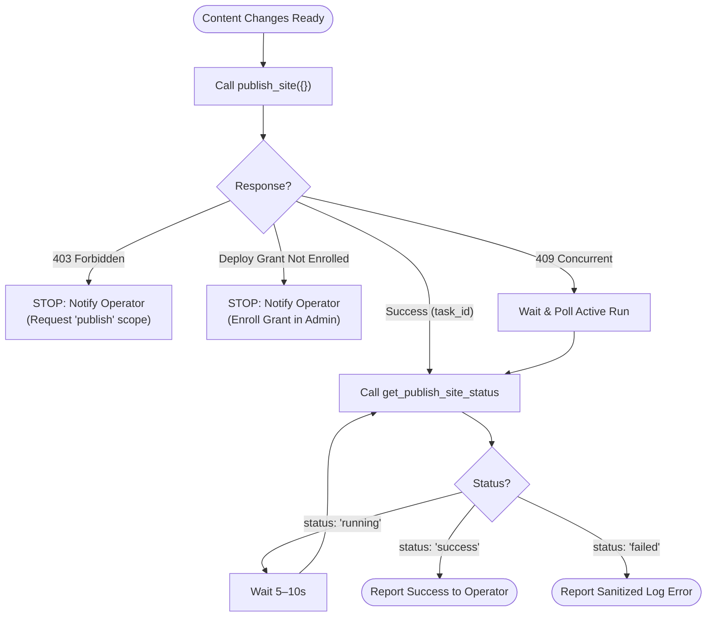

# Publish with agents (hybrid How-To)

Human sponsors the host secrets once. Agent edits content and deploys the static site. Human revokes either the agent key or the Deploy Grant independently.

This guide is for **operators directing agents** and for agents that already hold a `pen-sk-…` with scope `publish`. Human-only UI steps (first SFTP/platform connect, Export zip, webhooks): [`publish-howto.md`](./publish-howto.md). Full MCP setup: [`mcp_guide.md`](./mcp_guide.md). Users, presets, and key mint: [`users-and-access.md`](./users-and-access.md). Agent-owned site persona: [`agent-owned-site.md`](./agent-owned-site.md).

---

## North-star vignette (hybrid)

> You run PenCMS on a VPS. You connect **Publish → Settings** to your public host and unlock the vault once to store the SFTP password (or use SSH key auth). You enroll a **Deploy Grant** — an explicit opt-in that leaves Zero-Knowledge for that host secret so the *server* can decrypt it at deploy time. You mint an agent key with scopes `read`, `write`, and `publish`, and hand the agent only `pen-sk-…`.
>
> The agent updates posts via MCP, then calls `publish_site`. PenCMS builds `dist/` and deploys. The agent **never** sees the host password or platform token.
>
> When the experiment ends, you revoke the agent key **or** clear the Deploy Grant. Either knob stops further host deploys.

If that story stays true, you are using Publish the way PenCMS intends.

---

## Two different “publish” tools

| Tool | Scope | Inputs | What it does |
|---|---|---|---|
| **`commit_and_push`** | `write` | `{ "message"?: string }` | Git stage / commit / optional push of **content** |
| **`publish_site`** | `publish` | `{}` *(empty!)* | Build static `dist/` and deploy to the **configured host** |
| **`get_publish_site_status`** | `publish` | `{ "task_id"?: string }` | Poll a host-deploy run (`task_id` optional) |
| **`get_publish_status`** | `read` | `{ "task_id"?: string }` | Poll a **git** push task from `commit_and_push` |

> **Critical Agent Note on Parameters**: `publish_site` accepts **zero** arguments. Never pass host credentials, SSH passwords, or platform tokens in tool call arguments. PenCMS retrieves stored credentials automatically via the Deploy Grant.

Content `write` (legacy) and `write:posts` do **not** imply host deploy. Host deploy requires scope `publish` **and** an enrolled Deploy Grant. `publish:content` is content/translation review, not host deploy.

Do not put SFTP passwords or platform tokens in agent env files. Agents call PenCMS; PenCMS talks to the host.

---

## Human setup (once per site)

### 1. Connect the publish target

Follow [`publish-howto.md`](./publish-howto.md): Provider + host fields, vault password or SSH key, **Test Connection**, optional first manual **Publish**.

Prefer **SSH key** auth for agentic SFTP when the host allows it — the grant stays flag-only (use install Ed25519) with no password duplicated into server storage.

### 2. Enroll a Deploy Grant

1. Open **Publish → Settings** (active Content site correct in the header).
2. Find **Allow agents to publish to this host**.
3. Read the warning: enrolling **leaves Zero-Knowledge** for that secret — the install holds ciphertext decryptable by the server (password/token providers), or a flag-only grant for key auth.
4. Click **Enroll Deploy Grant** (vault unlocked if a password/token must be copied into the grant).

Revoke anytime with **Revoke Deploy Grant**. That does not delete the agent key; it only stops host deploy until you enroll again.

### 3. Mint an agent key with scope `publish`

**Admin UI:** Settings → AI → Agent Keys → name + site → preset **Publisher** (or legacy **Read + Write + Publish**) → Generate. Copy `pen-sk-…` once. Only install admins can mint keys — see [`users-and-access.md`](./users-and-access.md).

**API:**

```http
POST /api/auth/keys
Content-Type: application/json

{"name":"blog-deployer","scopes":["read","write","publish"],"site_id":"default"}
```

Or approve-code bootstrap (`request-code` → admin Approve → `verify-code`) with `"scopes":["read","write","publish"]` — see [`mcp_guide.md`](./mcp_guide.md).

Store the key with restrictive permissions (e.g. `~/.pencms/credentials` mode `0600`). Never put the host password next to it.

---

## Agent path (after enrollment)

### Exchange key → JWT

```bash
curl -X POST https://cms.example/api/auth/token \
  -H "Content-Type: application/json" \
  -d '{"agent_key":"pen-sk-…"}'
```

Use `Authorization: Bearer <JWT>` on `/api/mcp` (or the REST publish endpoints).

### Deploy

1. Edit content with the usual write tools (`create_post`, `write_content_file`, …).
2. Optionally `commit_and_push` if you also want Git history updated.
3. Call **`publish_site`** (no host-secret arguments — none are accepted).
4. Poll **`get_publish_site_status`** with the returned `task_id` (or without `task_id` for the site’s current/idle run) until `status` is success or failure.

REST equivalents (same auth rules):

| Method | Path |
|---|---|
| `POST` | `/api/publish/run` |
| `GET` | `/api/publish/status?site=` (optional `task_id`) |

Tool results and status payloads never include host passwords or platform tokens.

### Typical failure modes & Agent Decision Flow

| Response | Meaning | Action for Agent |
|---|---|---|
| `403` / insufficient scope | Key lacks `publish` scope | **STOP.** Notify human operator: *"Please re-mint or edit agent key to include scope 'publish'."* |
| `Deploy Grant not enrolled` | Missing host permission grant | **STOP.** Notify human operator: *"Please enroll a Deploy Grant under Publish → Settings in PenCMS admin."* |
| `409` concurrent run | Publish currently in progress | **WAIT & POLL.** Call `get_publish_site_status` every 5-10 seconds until status is `success` or `failed`. Do not spawn a new run. |
| Remote host error in log | SFTP auth failed / host down | **STOP.** Report the sanitized log error to the human operator to verify host credentials or SSH keys. |

#### Agent Execution Flowchart



---

## Independent revoke

| Knob | Where | Effect |
|---|---|---|
| **Revoke agent key** | Settings → AI → Agent Keys | That agent cannot call MCP (including `publish_site`) |
| **Revoke Deploy Grant** | Publish → Settings | No agent (any key) can host-deploy this site until re-enrolled; interactive Publish with vault still works |

Revoking one does not revoke the other. Prefer revoking the grant if you want to keep content `write` but stop deploys; revoke the key if the agent should lose all access.

---

## Checklist (cold start)

**Human**

- [ ] Publish target configured and Test Connection OK
- [ ] Deploy Grant enrolled (ZK-leave warning acknowledged)
- [ ] Agent key minted with `publish` (and usually `read`/`write`) for the right `site_id`

**Agent**

- [ ] `POST /api/auth/token` → Bearer JWT
- [ ] Content edits via MCP write tools
- [ ] `publish_site` → poll `get_publish_site_status`
- [ ] Never request or log host passwords

**Human teardown**

- [ ] Revoke key and/or Deploy Grant when the agent should stop

---

## Related

- Human Publish UI: [`publish-howto.md`](./publish-howto.md)
- MCP gateway, OAuth, tool table: [`mcp_guide.md`](./mcp_guide.md)
- Product thesis (human sponsors the machine): [`product_thesis.md`](./product_thesis.md)
- Discovery stub: [`llms.txt`](./llms.txt)
